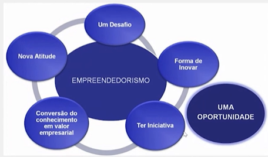

# Empreendedorismo e Criação de Novos Negócios

Link da página no Notion (para README): Empreendedorismo e Criação de Novos Negócios (<https://www.notion.so/Empreendedorismo-e-Cria-o-de-Novos-Neg-cios-a438c6905f374152942f164722e1b1cb?pvs=21>)
Plano de estudos DB: Faculdade: Análise e Desenvolvimento de Sistemas (AdS) (<https://www.notion.so/Faculdade-An-lise-e-Desenvolvimento-de-Sistemas-AdS-3539e350bf1a49e0a63da92c8698c4df?pvs=21>)
Status: Em andamento
Data: 11/01/2024

## Índice

## Antes de começar

- [x]  Criar pasta referente ao curso
- [x]  Adicionar link da pasta nos atributos do curso
- [x]  Adicionar arquivos e links adicionais ao repositório (pdf, pptx, etc)

## Empreender ou não, eis a questão

### Conceito de Empreendedorismo

Disciplina ministrada pelo Prof. Thiago Oliveira da Silva.

> Empreendedorismo é a capacidade que uma pessoa tem de **identificar problemas e oportunidades**
>

O empreendimento pode ser um **negócio, projeto ou movimento** que gere mudanças no cotidiano das pessoas.

---

**Conceito de Empreendedorismo**

O ato de empreender geralmente está ligado à **inovação, abertura de novos mercados** e criação de métodos de produção e comercialização.

Empreendedorismo também envolve a capacidade de **projetar e idealizar novos negócios** e transformações inovadoras ou arriscadas.

### Definições práticas

**Definição Prática**

Empreendedorismo está relacionado diretamente com a **execução prática** de uma ideia, solução ou serviço inédito.

Para ser empreendedor é **necessário ser pioneiro**, não necessariamente fazendo algo extremamente inédito, mas entregando algo diferente do usual e de qualidade.

Além disso, empreendedorismo envolve algumas outras características que se integram para formá-lo, como **desafios**, **novas atitudes**, **iniciativa, oportunidade aproveitada** e **inovação** .

> Joseph A. Schumpeter, cientista político e economista, associou o empreendedorismo ao desenvolvimento econômico com o termo **destruição criativa** que fundamenta a ideia de que é necessário **destruir o antigo para se criar o novo**
>

### Modelos de Negócios existentes

**Modelos de negócios existentes focando no Brasil**

No Brasil existem diversos modelos de negócios possíveis para o empreendedor, como:

- **Franquia →** franquia é um modelo mais tradicional, pois é possível **desenvolver um negócio a partir de um modelo já existente**, exemplos incluem MC Donalds, Boticário e Chilli Beans;
- **Assinatura** → modelo que vem se tradicionalizando e se refere ao **pagamento recorrente de um serviço ou produto,** exemplos incluem Netflix e  Amazon Prime;
- **Freemium** → similar à assinatura, mas disponibiliza recursos grátis ou limitados por um certo certo período enquanto quem desejar mais acesso precisa pagar;
- **Marketplace** → a disponibilidade de uso ofertado por marcas maiores para às menores, de forma que lojas varejistas conseguem vender em lojas gigantes exemplos incluem Amazon e Magazine Luiza
- **Economia colaborativa** →  se dá pela **conexão de interesses econômicos distintos**, de forma que todos os colaboradores tenham interesses alinhados aos objetivos maiores, como por exemplo Uber e Airbnb.

---

**Tipos de empreendedores**

Existem 3 tipos de empreendedores, sendo eles:

- **O técnico** → o empreendedor que possui o **tato e conhecimento do negócio**
- **O gestor** → o que possui a **perspicácia para gerir negócios**
- **O visionário** → o que possui o **feeling para contemplar novos negócios** e oportunidades onde as demais pessoas não conseguem

### A criatividade no empreendedorismo

**O que é a criatividade no empreendedorismo?**

> É a capacidade de criar e transformar e é fundamental para garantir sucesso de um negócio
>

Para desenvolver criatividade temos que nos desapegar da ideia de aptidão para criatividade e precisamos **ter coragem para arriscar**, errar e aprender, sabendo que **isso faz parte do processo para se tornar mais criativo**

Devemos **ignorar os modelos prontos**, tentando sempre pensar fora da caixa, pensando em modelos que podem dar certo além dos que já funcionam

Busque sempre fazer algo diferente que ninguém ou poucos fizeram.

Um sigla para criatividade no empreendedorismo é **BIP - bom humor, irreverência e pressão**, características que são necessárias para qualquer bom empreendedor

### Texto: Empreender ou não, eis a questão

- PDF

    [Empreendedorismo E Criação De Novos Negócios.pdf](./for_readme/Empreendedorismo_E_Criao_De_Novos_Negcios.pdf)

## Empreendedorismo e Suas Características

### Empreendedor corporativo

O empreendedor corporativo é aquele que idealiza processos e estratégias para ir além da convenção.

Um empreendedor corporativo possui **visão sistêmica** que possibilita enxergar todas as cadeiras e etapas do processo e amarrações do empreendimento.

Além dessa característica, possui algumas outras como:

- **Capacidade inovadora** → capacidade de pensar fora do padrão, criando novas formas de resolver problemas
- **Foco** → capacidade de focar nos objetivos concretos e alcançáveis
- **Criatividade** → capacidade de **desenvolver** **ideias**
- **Ousadia** → capacidade de **arriscar ideias**
- **Senso de liderança** → capacidade de visualizar pontos a serem desenvolvidos em si e na equipe sem ultrapassar limites
- **Comportamento positivo** → capacidade de respeitar os limites de seus subordinados

---

**O que um empreendedor corporativo precisa ter?**

Além das características anteriores, um empreendedor também deve ter como perfil:

- **Facilidade de expor ideias →** saber vender produtos e ideias
- **Ser questionador** → saber questionar o convencional buscando melhorias
- **Ter disposição de enfrentar riscos** → saber que não há certezas
- **Ajudar a empresa em fases de mudança** → ajudar a empresa com mudanças que ocorrem

---

**Diferença entre líder e empreendedor corporativo**

A principal diferença entre o líder e o empreendedor corporativo é que o **líder segue decições de alta gerência (Top-Down).**

O empreendedor corportativo tem cultura empreendedora em todos os níveis organizacionais.

### Texto: Empreendedorismo e Suas Características

- PDF

    [02 - Empreendedorismo E Criação De Novos Negócios.pdf](./for_readme/02_-_Empreendedorismo_E_Criao_De_Novos_Negcios.pdf)

**Ambiente empreendedor**

O ambiente empreendedor pode ser dividido em 2, sendo o **ambiente interno** e **ambiente externo.**

O ambiente externo é **tudo o que não é facilmente controlável pelo empreendedor**. Eles podem se apresentar como **fornecedores, clientes e concorrentes que o mercado impõe**, por exemplo.

O ambiente interno é tudo **o que pode ser controlado pelo gestor**, podendo por exemplo ser a **cultura da empresa, produto ofertado**.

> Um ponto importante é que o empreendedor precisa **saber lidar** com a especificidade e necessidade de **ambos os ambientes**
>

O empreendedor precisa entender a perspectiva de cada indivíduo que faz parte da cadeira de processo, por exemplo, clientes, fornecedores e acionistas.

Com este entendimento geral o negócio será facilmente um sucesso.

---

**Formas do empreendedorismo**

O empreendedorismo pode se apresentar de diferentes formas, podemos citar 4 delas como sendo:

- Empreendedorismo corporativo
- Empreendedorismo franqueado
- Empreendedorismo inesperado
- Empreendedorismo digital

---

**Empreendedor corporativo**

> É aquele que acontece dentro das organizações e promove melhorias de processos e inovação interna
>

O empreendedorismo corporativo exige uma comunicação e esforço para desenvolver uma equipe com cultura empreendedora.

Uma cultura empreendedora pode ser caracterizada por diversos aspectos, mas podemos listar como exemplo:

- Macroempreendedor
- Contexto do indivíduo empreendedor
- Características individuais
- Processos e práticas empresariais

---

**Empreendedor franqueado**

Na franquia você adquire o direito de vender, ofertar e/ou negociar a partir de uma marca já existente

Esse modelo possibilita aproveitamento de marcas, processos e mercados já estabelecidos, o que o torna atrativo para quem tem um perfil mais conservador, já que traz menos autonomia e risco individual.

Algumas vantagens das franquias incluem:

- Dividir o ônus de fazer pesquisas tecnológicas;
- Ofertar linhas de produtos de qualidade superior mais diversificada;
- Exercer mais força no mercado em favor do cliente, abrindo possibilidade de atuar no mercado internacional
- Compartilhar recursos e poder de compra

Algumas desvantagens do modelo de franquias:

- Autonomia parcial sobre decisões a cerca do negócio
- Padronização excessiva
- Localização forçada
- Maior controle por parte do dono em relação a marca.

---

**Empreendedor inesperado**

O empreendedor inesperado é o tipo que quando menos espera se depara com uma oportunidade de negócio e decide mudar o que fazia para se dedicar ao negócio próprio.

Geralmente as características deste empreendedor são:

- Similar a quem empreende por oportunidade
- Posterga a entrada no mercado, pesquisando muito para ter uma entrada mais sadia e segura no mercado
- Não é arrojado, geralmente apresenta um grau menor de inovação e riscos

---

**Empreendedor Digital**

O empreendedor digital se assemelha aos demais em muitas características.

Tendem a ser pessoas entre 25 e 40 anos que se arriscam em um novo mercado com grande oportunidade de negócio.

O empreendedor que decide se arriscar no mercado digital deve entender toda a específica de do negócio e do mercado em que se encontra.

Para que a área de marketing de um negócio digital consiga basear suas ações em performance ela deve utilizar dados captados do mercado e setor que atua

## Perfil do empreendedor

### Capacidade de planejamento

A capacidade de planejamento é essencial para qualquer empreendedor.

É necessário saber **aonde se está** e aonde **se quer chegar**.

É necessário **monitorar**, **corrigir** e **rever**.

---

**Passos para capacidade de planejamento**

Existem alguns passos principais:

- **Iniciativa** → vontade de fazer o negócio acontecer
- **Persistência** → capacidade de se adaptar sem desistir com as frustrações
- **Buscar informações** → buscar as informações que faltam para se desenvolver
- **Visão empreendedora** → visualizar o ambiente de forma macro e ampla do negócio

Algumas citações de grandes empreendedores:

### Capacidade analítica

A capacidade analítica é composta de algumas características:

- **Capacidade de realização** → capacidade de destrinchar e executar grandes planos
- **Habilidade de persuasão e relacionamento** → nada se faz sozinho, importante saber se relacionar e persuadir
- **Administradores** → saber administrar tudo isso
- **Visão inovadora** → ser capaz de inovar, pensar fora da caixa
- **Realizadores** → ser capaz de executar o que deve ser feito

Alguns dados das empresas já existentes:

### Liderança e motivação

<aside>
💡 Um **bom líder** sabe conquistar respeito da equipe e um **bom empreendedor** sabe identificar oportunidades e transformá-las em uma organização lucrativa

</aside>

O empreendedor deve se tornar um líder, pois no mercado é necessário desenvolver habilidades de liderança como empatia, persuasão, autoconfiança e aprender a dar e receber feedbacks.

Um bom líder e empreendedor precisa desenvolver certas características:

- **Motivação** → é necessário ser motivado para ser um bom líder
- **Reconhecimento** → é necessário dar reconhecimento para seus colaboradores
- **Positivismo** → capacidade de ser positivo com relação aos desafios alcançados ou não

Outros itens são:

<aside>
💡 **Liderar não é impor, é despertar nos outros a vontade de fazer**

</aside>

### Capacidade de calcular riscos e assumir responsabilidades

### Texto: Perfil do empreendedor

- PDF

    [03 - Empreendedorismo E Criação De Novos Negócios.pdf](./for_readme/03_-_Empreendedorismo_E_Criao_De_Novos_Negcios.pdf)

A abertura de um novo negócio deve estar alinhado às necessidades do mercado e disponibilidade de envolvimento do empreendedor.

Enquanto alguns buscam ser seu próprio chefe outros buscam mais renda ou possibilidade de impacto no mercado em que atuam.

## Sendo empreendedor no Brasil

### Estabelecimento de metas

> Ser empreendedor é muito mais que ter vontade de chegar no topo, é conhecer a montanha e o tamanho do desafio. Saber os detalhes da subida, melhores ferramentas, se preparar fisicamente, etc.
>

### Exigência de qualidade e eficiência

Qualidade atrelada ao preço atrai muito os clientes.

A qualidade tem um ingrediente a mais, apesar do preço ser mais atraente na primeira opção.

Por exemplo, ao atrelar um cliente ao preço, ao cliente reutilizar o produto as vezes ele desiste, mas atrelado à qualidade ele dificilmente abrirá mão.

Toda empresa deve buscar se destacar na qualidade ao entrar em um mercado para que seus clientes tenham atração em relação aos concorrentes.

Produtos e serviços devem atender à 3 características básicas da qualidade:

- **Grau em que um produto ou serviço atende às necessidades do cliente** → produtos que buscam resolver necessidades e problemas reais
- **Adequação ao uso** → produtos que são flexíveis para o uso dos clientes
- **Conformidade com os requisitos** → aquilo que seu cliente requer do produto se encontra nele

---

**Exigências de qualidade e eficiência**

Se tratando de qualidade e eficiência existem algumas exigências nas fases de uma empresa que busca apresentar planejamento na qualidade:

- **Levantamento de requisitos** → pesquisas de mercado para entender os desejos e anseios dos clientes
- **Ferramentas** → formulários, softwares para saber a exigência dos clientes
- **Resultados** → os resultados a partir daquilo que os clientes desejam

---

**Eficiência x Eficácia x Efetividade**

Ao buscar ser eficiente é importante entender a diferença entre eficiência, eficácia e efetividade, de forma que:

- **Eficiência** → algo que consegue o melhor rendimento com o mínimo de erros e / ou desperdícios
- **Eficácia** → possui relação direta com o que produz resultado e determinado efeito, ou seja, algo que resolve o problema proposto
- **Efetividade** → é a capacidade de fazer algo (eficácia) e da melhor maneira possível (eficiência)

### Persistência e comprometimento

> Persistência é a característica daquilo ou daquele que não desiste fácil
>

> Comprometimento é utilizado para especificar a obrigação, dever ou uma promessa
>

Para conquistar nossos **sonhos** é preciso transforma-los em **objetivos**, ou seja, precisam de planejamento e muita persistência.

É possível também alguém persistir sem comprometimento, pois a insistência sem comprometimento se baseia em oscilação.

Estar comprometido é ter um **compromisso sério com seus clientes**, colaboradores e consigo mesmo.

Comprometimento envolve **sacrifícios pessoais**, mão na massa e honra, ou seja, exige abrir mão de muitas questões pessoais, colocando os objetivos acima de alguns outros valores.

Alguns tópicos envolvendo comprometimento e persistência:

- Ser persistente
- Capacidade de correr riscos calculados
- Ter iniciativa
- Exigir qualidade dentro do negócio
- Buscar (des)aprender →  sempre que identificar problemas nos aprendizados
- Estabelecer metas realizáveis → de forma que não perca o foco e conclua o proposto
- Ter uma ampla rede de contatos

### Persuasão e rede de contatos

Persuadir significa convencer. É a capacidade de despertar interesse e necessidade em determinado cliente.

O empreendedor sempre escolhe as melhores estratégias para convencer seus clientes.

---

**Persuasão e rede de contatos**

A rede de contatos é o famoso network.

Ao fazer conexão com pessoas chave você pode gerar oportunidades e valores pra sua empresa.

Com uma rede de contatos você:

- Detecta possibilidades
- Cria oportunidades
- Assume riscos inerentes

Perguntas que devem ser feitas ao construir uma rede de contatos incluem:

- O que pretendo alcançar? → o que eu quero com essa rede que irei criar
- Aonde quero chegar?
- Qual meu objetivo?

Na negociação e persuasão de negócios existem riscos inerentes e o resultado pode ser:

- Ganha - perde
- Perde - ganha
- Ganha - ganha
- Perde - perde

### Texto: Sendo empreendedor no Brasil

- PDF

    [04 - Sendo empreendedor no Brasil.pdf](./for_readme/04_-_Sendo_empreendedor_no_Brasil.pdf)

## Crise e oportunidades no empreendedorismo

### Conceitos e definições sobre crise e oportunidades

A crise traz insegurança para investimentos, principalmente os de maior risco.

---

**Teoria das forças futuras**

Crises econômicas surtem efeito em diversas áreas, tais como:

1. **Distribuição de renda** → em crises a distribuição de renda muitas vezes acaba mudando
2. **Educação** → afeta a maneira de estudar, migrando pra diversas alternativas
3. **Infraestrutura** →  se re-adequa às necessidades da população
4. **Governo** → mudanças regulatórias
5. **Economia** → incertezas econômicas, alta taxa de desemprego
6. **Saúde pública** → necessidade de implementação de novas políticas e normas
7. **Meio ambiente** → menos ou poluição
8. **Tecnologia** → permeia todas as outras forças

---

**Conceitos e definições**

Empresas como Uber e Airbnb se aproveitaram de crises para se manter competitivas.

Além disso, existem certas áreas que podem se beneficiar de algumas crises, como ramos de:

- Produtos essenciais
- Agregados
- Adiáveis
- Dispensáveis

### Ideia x Oportunidade de negócio

Uma ideia é diferente de uma oportunidade de negócio, em medida que uma **ideia não precisa ser economicamente viável**.

Em geral uma ideia é **espontânea** e pode se tornar uma **oportunidade.**

Uma oportunidade nasce quando um **nicho não está sendo atendido** de maneira satisfatória.

---

**Como a oportunidade aparece?**

A **oportunidade é um alvo móvel** e deve se **ajustar ao perfil** do empreendedor, ou seja, **para ser capaz de opinar sobre saúde é importante que o empreendedor faça parte deste meio.**

Também é importante **olhar ao redor**, ter foco em **nichos potenciais** e ter franquias ou licenças de produtos.

### Técnicas de Identificar oportunidades

Para identificar oportunidades é necessário avaliar a identificação de consumidores e outros fatores como proposição de **valor de marca**, **concorrentes diretos** e **indiretos**, cadeia de **suprimentos**, **regulamentação** e **meio ambiente**.

Diante de oportunidades é importante ter certas coisas claras, como:

- **O perfil de empreendedor que você se encaixa** → você arrisca mais? É mais analítico? Mais entendedor?
- **As tendências do mercado** → o que o mercado está precisando ou pedindo
- **Uma ideia grande** → ter uma ideia atraente que provoque interesse
- **Identificar o cliente** → ter clareza de quem é o público alvo
- **Toda oportunidade tem seu tempo** → algumas ideias boas podem ser aproveitadas em outros momentos para ter mais impacto
- **Que problemas busca resolver?** → oportunidades de negócio nascem de dores dos consumidores, como por exemplo bikes e patinetes de aluguel para uma cidade com problemas de deslocamento

---

Segmentação de consumidores

Também existem análises mais externas para ter sucesso na empreitada, como:

- **Segmentação dos consumidores** → qual segmento / recorte de consumidores o negócio vai focar
- **Análise da situação de compra** → quando e porquê o público busca seu produto
- **Análise dos concorrentes diretos** → ao saber quem são os concorrentes possibilita benchmark para saber onde focar para ter diferencial
- **Análise de concorrentes indiretos** → observar possíveis concorrentes indiretos que competem por espaços de forma indireta, por exemplo, para um restaurante um serviço de entrega de comida caseira que impede o consumidor de ir até seu local de venda
- **Análise de produtos e serviços complementares** → importante se manter informado dos produtos agregados que contribuem com o seu negócio

### Em toda crise pode haver oportunidades

Elementos que toda crise possui incluem:

- **Uma data para acabar** → toda crise inicia e acaba
- **Novas oportunidades** → toda crise gera oportunidades
- **Ensinamentos** → toda crise serve de aprendizado

As atividades econômicas são **cíclicas**, entre altos e baixos. Cabe aos gestores ficarem atentos para aproveitar e fazer os ajustes necessários para as melhores oportunidades.

O **marketing** é quase sempre um dos **primeiros cortes de gastos**, mas pode ser uma escolha ruim, pois em momentos de crise uma empresa que se estabeleceu de forma contrária ao que a crise afeta pode precisar se reinventar para seus clientes.

---

**Autoconhecimento e empreendedorismo**

Para empreender é importante ter autoconhecimento também, certos tópicos auxiliam no desenvolvimento de bons negócios.

Algumas lições de autoconhecimento incluem:

1. **Seja para depois ter** → seja o que precisa ser para conquistar o que deseja
2. **Conheça-se emocionalmente** → mapeie suas emoções e seu perfil para ajudar no foco dos objetivos
3. **Aprenda com os erros** → esteja aberto para aprender com os erros
4. **Tenha a si mesmo como parâmetro (e não os outros)** → não pense no negócio dos demais, foque nos seus objetivos
5. **Adapte-se para as novas oportunidades** → esteja sempre aberto e flexível

### Texto: Crise e oportunidades no empreendedorismo

- PDF

    [05 - Crise e oportunidades no empreendedorismo.pdf](./for_readme/05_-_Crise_e_oportunidades_no_empreendedorismo.pdf)

## Mapeando oportunidade de negócios

### Processo Empreendedor

> O processo empreendedor é o processo através do qual uma ou mais pessoas pessoas poem em marcha uma idéia de negócio.
>

---

**Empreender é inato ou treinável?**

Tudo envolvendo empreendedorismo pode ser treinável.

Algumas questões que devem ser desenvolvidas para se tornar empreendedor são:

1. A capacidade de identificar e avaliar uma oportunidade
2. Desenvolver o plano de negócios
3. Determinar e captar recursos necessários
4. Gerenciar a empresa criada

### Ideia e oportunidade

Uma boa ideia é o princípio de um projeto que pode se materializar em um plano concreto.

Por isso é importante lapidar e selecionar somente boas ideias para execução.

Podemos ter em mente um funil de ideias:

A ideia é podar as ideias que não se alinham com os caminhos desejados para o negócio e focar nas que acrescentam.

Alguns pontos sobre ideais são que:

- Elas precisam ser relevantes para um grupo de pessoas
- Precisam viabilidade técnica, financeira entre outros
- Devem estar de acordo com as prioridades da empresa
- É necessário ter pontuação do impacto que a ideia tratá

Lembrando que uma ideia não necessariamente é uma oportunidade de negócio, e vice e versa.

### Fontes de novas ideias

Os empreendedores de sucesso sempre buscam novas ideias de negócio.

Algumas características de bons empreendedores são:

- **Ser curioso e questionador** → buscar entender erros e acertos de outros negócios
- **Novas ideias só surgem quando a mente está aberta** → é necessário estar flexível e antenado ao ambiente para captar novas ideias
- **Informação é a base de novas ideias** → necessário se manter informado sempre para ter novas ideias

Para ter novas ideias de sucesso devemos primeiro idealizar, depois conceituar, depois experimentar e então implementar.

Em cada uma dessas etapas existem sub-etapas que contribuem para o sucesso entre elas.

Ideias podem partir de certos pilares, como os da imagem abaixo:

### Análise dos concorrentes diretos e indiretos

Existem dois tipos de concorrentes, os diretos e indiretos.

Os dois tipos de concorrentes se diferenciam de forma que:

- **Concorrentes diretos** → buscam o mesmo público alvo e tem a mesma oferta de valor
- **Concorrentes indiretos** → possuem o mesmo público alvo, mas possuem ofertas e valores diferentes

Por exemplo, um restaurante tem como concorrente direto outro restaurante, mas como concorrente indireto um fornecedor de marmitas que leva a comida até a casa de seus consumidores.

Para identificar os concorrentes, devemos:

- **Fazer pesquisa de mercado**
- **Fazer pesquisa exploratória**

### Texto: Mapeando oportunidade de negócios

- PDF

    [06_mapeando_oportunidades_de_negocios.pdf](./for_readme/06_mapeando_oportunidades_de_negocios.pdf)

## Recursos tecnológicos no empreendedorismo

### Softwares disponíveis no mercado no auxílio à criação de novas empresas

Vantagens de softwares de gestão:

- Melhora na comunicação
- Alinha funcionários às métricas
- Informações seguras e consolidadas
- Reduz a dependência de consultorias

---

**Softwares interessantes para empresas**

- CRM, exemplo, Hubspot
- Criação de logo e branding, logaster
- Contabilidade, Wave
- Design gráfico, canva
- Gerenciar redes sociais, buffer
- Pesquisa, Survey monkey

### Planilhas no desenvolvimento de novos negócios

### Análise 360º

Análise 360 fornece uma visão fácil e objetiva de se uma ideia é lucrativa ou não e se é factível ou não.

---

**O que uma análise 360º busca responder?**

Para análise 360 graus é necessário ter uma resposta para:

1. A ideia que você tem faz parte da sua paixão? Ou seja, parte de uma solução e não de um produto.
2. Sua ideia tem um desafio intelectual? Ela te leva a se manter evoluindo a médio e longo prazo?
3. Seu negócio tem uma possível grande demanda? A demanda será suficiente para suprir expectativas de ganhos?

### Mapa de empatia

Mapa de empatia ajuda a criar segmentos para os comportamentos e necessidades de clientes.

O mapa é dividido em 2, onde a parte de cima busca responder perguntas do seu cliente e a parte de baixo busca entender o problema / solução.

Parte de cima:

- O que pensa ou sente? →
- O que escuta? → O que as pessoas dizem para ele? Quem o influencia com o que diz?
- O que fala e faz? → Como ele se expõe em fala e atitude? Que hábitos ele tem?
- O que vê? → O que ela enxerga quando procura um produto ou serviço? No que ela presta atenção?

Parte de baixo:

- Quais as dores do cliente? → O que incomoda os clientes? Quais desconfortos ele tem com serviços de concorrentes?
- Quais os ganhos do cliente? → O que ele busca com seus serviços? O que ele espera?

### Texto: Recursos tecnológicos no empreendedorismo

- PDF

    [07_recursos_tecnologicos_no_empreendedorismo.pdf](./for_readme/07_recursos_tecnologicos_no_empreendedorismo.pdf)

## Ferramentas do Plano de Negócio

### A importância do Plano de Negócio

O plano de negócios servem para detalhar as práticas da concorrência para possibilitar melhorias do seu produto ou serviço.

Ele ajuda a **definir o objetivo principal** do negócio, auxiliando nas tomadas de decisão.

Alguns pontos importantes de planos de negócio incluem:

- Analisar **concorrentes** e práticas competitivas
- Definir a **área de atuação** / nicho do mercado
- **Viabilizar um produto** em determinado mercado
- No marketing e vendas, **analisar o público alvo** e concorrentes relevantes

---

**O que o plano deve estabelecer?**

- MIssão e visão
- Análise de mercado
- Plano de marketing
- Plano financeiro

### Identifique a oportunidade

> Oportunidade é uma circunstância favorável ou conveniente para que algo ocorra
>

Oportunidade no empreendedorismo nasce da descoberta de diferenciais competitivos a partir da **inquietação**, **desejo**, **necessidade** ou **desconforto** de algum produto ou serviço.

---

**Cenário das oportunidades**

---

**Como identificar uma oportunidade**

Para identificar uma oportunidade devemos partir de **quem será o consumidor,** as demais avaliações devem partir disso.

### Business Model Canvas

Business Model Canvas NÃO é só pra empresas. Pode ser para carreira.

---

**Diagrama do Business Model Canvas**

O diagrama inclui:

1. Qual o segmento dos clientes?
2. O que será oferecido para o cliente?
3. Quais canais de contato e captação de clientes?
4. Qual meio de relacionamento com cliente, por quais canais?
5. Qual a fonte de renda do cliente? Condiz com o produto e segmento?

Exemplo do diagrama na prática

### Matriz F.O.F.A (SWOT)

Esta ferramenta possibilita analisar o ambiente interno e externo possibilitando analisar ameaças e oportunidades.

SWOT significa strengths, weaknesses, opportunities e threats, ou, forças, fraquezas, oportunidades e ameaças (FOFA).

---

**Os 4 pontos da analise SWOT**

### Texto: Ferramentas do Plano de Negócio

- PDF

    [08_ferramentas_do_plano_de_negocios.pdf](./for_readme/08_ferramentas_do_plano_de_negocios.pdf)

## A estrutura do plano de negócios

### Sumário Executivo

O sumário executivo é o **resumo das informações** mais importantes do projeto.

---

**O que um sumário executivo deve ter?**

Deve ser resumido e ter algumas informações para vender para potenciais investidores e olheiros.

Necessário:

- Chamar atenção visualmente
- Ter escrita clara e objetiva
- Detalhar a ideia → de forma bem estruturada e lógica
- Não se prender à teoria, ser prático
- Enfatizar contrapartidas e parceiros

O sumário executivo pode ser apresentado e vendido para diversos interessados, como:

- **Investidores**
- **Instituições financeiras**
- **Parceiros**
- **Sócios em potencial**

Algumas informações importantes de se ter incluem:

- **Objetivos**
- **Produtos e serviços**
- **Segmento de clientes**
- **Localização (praça)**
- **Indicadores financeiros**
- **Regime tributário da empresa**

### Planejamento Estratégico do Negócio

Planejamento estratégico é um instrumento que serve para analisar potenciais cenários e recursos que podem ser aproveitados ou evitados para o sucesso do negócio

---

**O que um bom planejamento estratégico deve pensar?**

- Determinar objetivos a longo prazo
- Analisar os fatores internos que causam as questões mais importantes
- Gerar opção de estratégias que abordem essas questões, as priorizando
- Decidir entre as opções → de cenários e
- Monitorar as etapas do processo de planejamento

### Descrição da Empresa

A descrição da empresa é um resumo dos pontos mais importantes da empresa

- Sua história
- Equipe de gerenciamento
- Onde está localizada
- Missão
- Estrutura legal
- O que espera alcançar

Daí a importância de ter um site para apresentar a sua empresa

---

**O que deve conter na descrição da empresa?**

Alguns dados essenciais são:

- **Nome fantasia**
- **Tipo de enquadramento da empresa**
- **Resposta para questões como quando e porque a empresa foi criada, natureza dos produtos oferecidos, como a empresa se desenvolveu**

Exemplo:

### Análise de mercado

> Análise de mercado busca apresentar uma análise do setor de mercado e deve apresentar dados referentes ao tamanho, índice de crescimento e estrutura do setor que a empresa atua ou atuará
>

---

**O que a análise de mercado deve ter envolvendo o cliente?**

Devemos levar em conta o mapa de empatia ao analisar o mercado considerando o segmento de clientes.

### Texto: A estrutura do plano de negócio

- PDF

    [09_a_estrutura_do_plano_de_negocio.pdf](./for_readme/09_a_estrutura_do_plano_de_negocio.pdf)

## Comércio Eletrônico x Empreendedorismo

### A era do comércio eletrônico

O comércio eletrônico trouxe diversas vantagens em relação ao analógico, tais como:

- **Praticidade** → lojas eletrônicas são mais fáceis de encontrar a qualquer momento do dia
- **Pesquisa de preços** → é mais fácil e rápido de pesquisar e comparar preços online
- **Disponibilidade** → por não ter afinidade a um espaço físico e uma diversidade maior existe mais disponibilidade de ofertas e produtos

---

**A era do comércio eletrônico**

Na primeira era da indústria que foi criada para suprir necessidades da guerra não havia oferta e diversidade, pois era necessário suprir a falta do essencial.

Ou seja, clientes não podiam escolher e comparar características. Na era digital o consumidor tem essa capacidade.

 Exemplo: **escolher a cor do produto**, tamanho e layout

[https://www.notion.so](https://www.notion.so)

---

**Dados da era eletrônica**

[https://www.notion.so](https://www.notion.so)

Participação do comércio eletrônico nas vendas totais

[https://www.notion.so](https://www.notion.so)

### Empreendedorismo Digital

> É o ato de criar um negócio que pode funcionar na internet
>

Hoje em dia é mais fácil ter um negócio digital do que físico, pois o negócio físico envolve muitos investimentos de tempo e dinheiro devido a alocação e logística do espaço.

---

**Outros aspectos da atuação digital**

Para atuar de forma digital é importante ter em mente que ela possibilita:

- **Usabilidade** → facilidade de compra e acesso aos recursos
- **Facilidade de entrega** → rápida operação de entrega para compensar a distância do consumidor
- **Inteligência de mercado** → o segmento de clientes se expande, sendo necessário ser inteligente e focado
- **Comunicação assertiva** → comunicação direta e eficiente com o cliente e público alvo
- **Adoção de novas tecnologias** → se manter atualizado em tecnologias que auxiliem o processo de venda

### Como empreender virtualmente?

**Como empreender virtualmente?**

Para empreender virtualmente é necessário seguir os passos abaixo:

1. **Definir o nicho e público alvo** → por exemplo, definir faixa etária e finalidade de consumo do consumidor. Em que horários ele acessa as redes sociais?
2. **Se planeje financeiramente** → pense na estrutura de internet, escritório e custos relacionados
3. **Analise seus concorrentes e mercado**
4. **Escolha seu nicho de mercado**
5. **Crie conteúdo marketing de conteúdo**
6. **Identifique pontos fortes e fracos (SWOT)**
7. **Estude a rede social que tem relação com seu público** → seu público acessa qual rede social?

---

**Definições**

### Reputação virtual

### Texto: Comércio Eletrônico x Empreendedorismo

- PDF

    [10_comercio_eletronico_x_empreendedorismo.pdf](./for_readme/10_comercio_eletronico_x_empreendedorismo.pdf)

## Conceitos do Plano de Marketing

### Qual a importância do Plano de Marketing?

> Plano de marketing é um conjunto de informações que **guia a empresa** para alcançar seus objetivos de vendas e crescimento.
>

Esse plano pode e deve ser criado ou atualizado em qualquer momento do seu negócio.

Deve trazer informações para dar suporte à empresa, por isso antes temos que saber os **objetivos a curto e médio prazo.**

> Quanto antes trabalhar no planejamento, melhor
>
> Pode parecer burocrático criar um plano assim, mas é fundamental
>

> O planejamento é o **mapa** e a execução o **combustível** de seu carro
>

### **Como fazer o plano de marketing**

Antes de fazer precisamos entender os propósitos de um plano de marketing, eles incluem:

- **Elevar consciência** da marca no mercado
- Atrair, fidelizar e recuperar cliente
- Aumentar as vendas e lucratividade
- **Divulgar** produtos e serviços novos (ou não)

---

**Tipos de pesquisas**

Precisamos saber a diferença entre **pesquisa de marketing** e **pesquisa de mercado**

Pesquisa de mercado visa entender o mercado para determinado produto, pensando se há **demanda para consumo** (clientes) e se eles podem consumir (comprar) pelo produto ou serviço ofertado. **Ex: MC Donalds sabe que não tem mercado em cidades pequenas**

Pesquisa de marketing visa a coleta de informações para melhorar a tomada de decisões para a **solução de problemas** (oportunidades).

---

**Pesquisa qualitativa x quantitativa**

> Pesquisas **qualitativas** avaliam aspectos que **qualifiquem o produto** ou serviço
>

> Pesquisas **quantitativas** avaliam resultados numéricos e permitem **escalas comparáveis**
>

Outros pontos:

- O plano de marketing deve ser a primeira coisa
- O plano é essencial para todos negócios
- O planejamento de marketing deve ser visto como um guia para o marketing
- Devemos considerar o ambiente interno e externo

### 4 etapas do ciclo de vida dos produtos

Devemos considerar o aspecto do ciclo de vida de produtos, considerando a sua **criação**, **crescimento**, **maturidade** e **retirada do mercado.**

Por exemplo, existem produtos que tiveram seu crescimento e lançamento considerado mas que morreram cedo, ou seja, não maturaram. Um exemplo é a tecnologia Blueray que atualmente não se ouve falar tanto.

---

**As 4 etapas**

1. **Introdução** → nesta etapa o produto está sendo lançado, sendo necessário **investir em marketing de apresentação**
2. **Crescimento** → nesta etapa um determinado público descobre o produto e começa a **aumentar a taxa de crescimento de vendas** de maneira exponencial
3. **Maturidade** → nesta etapa o produto está consolidado e estabiliza suas vendas pois já teve **aceitação dos consumidores**
4. **Declínio** → as vendas e lucro começam a diminuir e começam a aparecer **concorrentes e substitutos.**

Um gráfico de como costuma se dar este processo:

### Marketing Digital

> Marketing digital é toda a forma que a empresa tenta **se aproximar do cliente digitalmente**
>

Para ter um bom Marketing Digital é necessário trabalhar os seguintes pontos:

- Transmitir **credibilidade** e se posicionar nos motores de busca
- Descubra o melhor **marketing de conteúdo**
- Invista em **emails de marketing**
- Seja **ativo nas redes sociais** interagindo com clientes

---

**Diretrizes a serem dominadas**

- **Se comunicar da forma correta** → saber conversar com a mesma linguagem do público alvo
- **Permitir que a organização se aproxime do cliente** → se mantenha ativo e com espaço entre o público alvo
- **Manter um controle do histórico do cliente** → fique de olho nos clientes ganhos e perdidos, sempre aproveitando oportunidades perdidas
- **Ter acesso a relatórios e gráficos de vendas** → não apenas números, mas saiba o que eles representam dentro dos seus clientes e empresa

### Texto: Conceitos do plano de marketing

- PDF

    [11_conceitos_do_plano_de_marketing.pdf](./for_readme/11_conceitos_do_plano_de_marketing.pdf)

## 4 P´s de Marketing

### Produto

> O produto envolve preocupações com a entrega do produto envolvendo suas características, cores, embalagem, acessórios entre outras decisões.
>

Alguns pontos devem ser levados, como:

- O que torna o seu produto ótimo ou único?
- Construir algo diferente do convencional
- Conhecer o que os concorrentes ofertam

Gráfico que representa os 4 Ps com enfoque no produto

---

**O que pode ser um produto?**

Produto é tudo o que a empresa venda, podendo ser desde a palestra de um congressista até a consulta de um psicólogo.

Um produto é tudo que disponibilizamos ao consumidor pensando na necessidade dele

---

Tipos de produtos

Produtos podem ser bens físicos ou serviços, a distinção se dá por:

### Preço

> Preço tem a ver sobre quanto custa e quanto vale o produto
>

O preço **não necessariamente está vinculado à qualidade.**

> Caro é aquilo que não tem valor.
>

Precisamos também considerar que o preço é ancorado no conhecimento da marca.

Não podemos inviabilizar o negócio vendendo abaixo do custo ou da qualidade do produto. Da mesma forma não podemos deixá-lo muito caro.

---

**Perguntas a ser feitas ao considerar o preço**

- **Qual seria o valor máximo aceitável pelo mercado** → quanto o público alvo está **disposto a pagar**?
- **Qual o menor valor viável** → qual valor a ser vendido que **mantenha uma margem de lucro**
- **O quão importante é o aspecto financeiro para seu cliente** → o quanto seus cliente se importam ou se preocupam com o valor? Qual a **percepção de valor dos clientes** para este segmento de produto
- **Como é seu preço em relação aos concorrentes** → em que ponto **seu produto se posiciona** no meio dos concorrentes?
- **Que preço praticam os que lideram o mercado que quer entrar** → quais **preços praticados por quem já está estabelecido no mercado**?

### **Praça**

> Praça é o lugar onde o produto é oferecido
>

---

**Garantir visibilidade**

Para garantir a visibilidade do público alvo podem ser feitas parcerias entre com o distribuidor.

Por exemplo:

- Coca cola fornece a geladeira para que os seus produtos estejam próximos ao caixa ou à vista do consumidor
- Supermercados cobram marcas para que possam se posicionar em locais favoráveis à vista de seus clientes

---

**Exemplos de praças**

A praça pode ser resumida como local onde o consumidor faz contato com o produto, não se limita a ambientes físicos.

Exemplos de preocupações com a praça são a logística, distribuição e pontos de contato.

### Promoção

> Promoção diz respeito à maneira com que o produto é promovido para seus clientes
>

A promoção **se preocupa com o aspecto de ambiente externo**. Sendo assim, se preocupa com campanhas publicitárias e acontecimentos externos a fim de promover a venda

---

**Pontos para se preocupar envolvendo a promoção**

Exemplo da Magazine Luiza

### Texto: 4 P´s de Marketing

- PDF

    [12_4ps_de_marketing.pdf](./for_readme/12_4ps_de_marketing.pdf)

## Planejamento Financeiro do Empreendedor

### **Capital de giro / Investimento total**

Exemplo de cálculo

### **Lucratividade / Rentabilidade**

### Ponto de equilíbrio

Tipos de ponto de equilíbrio

### **Prazo de retorno do investimento**

### Texto: Planejamento Financeiro do Empreendedor

- PDF

    [13_planejamento_financeiro_do_empreendedor.pdf](./for_readme/13_planejamento_financeiro_do_empreendedor.pdf)

## Conceitos e definições do Plano Operacional

### **Outros conceitos e definições importantes**

Plano de produção organiza e otimiza equipamentos e recursos para entrega de demandas.

Uma das vantagens de um plano de produção é aumentar a produtividade.

Outras vantagens incluem:

- Otimização de produção → previsibilidade de entregas e diminuição de gusto
- Previsão da rotina
- Minimização de perdas
- Redução de custos
- Controle de estoques
- Prevenção de atrasos

### **Layout ou arranjo físico**

### Empreendedorismo jurídico

### Perfil do empreendedor jurídico

### Texto: Conceitos e definições do Plano Operacional

- PDF

    [14_conceitos_e_definicoes_do_plano_operacional.pdf](./for_readme/14_conceitos_e_definicoes_do_plano_operacional.pdf)

## Caminhos para facilitar a criação de um novo negócio

### **Sebrae**

### Empretec

### Fontes de Fomento

### Como reduzir a mortalidade de empresas

### Texto: Caminhos para facilitar a criação de um novo negócio

- PDF

    [15_caminhos_para_facilitar_a_criacao_de_um_novo_negocio.pdf](./for_readme/15_caminhos_para_facilitar_a_criacao_de_um_novo_negocio.pdf)

## Novos tipos de empreendedores

### Startups

Características de uma startup

Exemplos de startup

Como criar uma startup

### Aceleradoras

### Incubadora

### **Dicas ao "jovem" empreendedor**

### Texto: Novos tipos de empreendedores

- PDF

    [16_novos_tipos_de_empreendedores.pdf](./for_readme/16_novos_tipos_de_empreendedores.pdf)

## Materiais de apoio e referências

- Ementa do curso

    [Ementa - Empreendedorismo e Criação de Novos Negócios.pdf](./for_readme/Ementa_-_Empreendedorismo_e_Criao_de_Novos_Negcios.pdf)

- VIDEO: Como montar um plano de negócio em 8 passos simples

    [https://www.youtube.com/watch?v=Vo58KINaPaA](https://www.youtube.com/watch?v=Vo58KINaPaA)

- ARTIGO: Marketing de serviços: uma visão baseada nos 8 Ps

    [https://sebrae.com.br/sites/PortalSebrae/artigos/marketing-de-servicos-uma-visao-baseada-nos-8-ps,a799a442d2e5a410VgnVCM1000003b74010aRCRD](https://sebrae.com.br/sites/PortalSebrae/artigos/marketing-de-servicos-uma-visao-baseada-nos-8-ps,a799a442d2e5a410VgnVCM1000003b74010aRCRD)

- VIDEO: 4Ps de marketing: o que são e como fazer

    [https://www.youtube.com/watch?v=sRXdjPDFhpE](https://www.youtube.com/watch?v=sRXdjPDFhpE)
