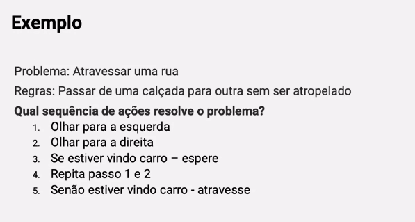

# Lógica de Programação

## Índice

- [Lógica de Programação](#lógica-de-programação)
  - [Índice](#índice)
  - [Introdução a Algoritmos](#introdução-a-algoritmos)
    - [Introdução a Algoritmos](#introdução-a-algoritmos-1)
    - [Algoritmos](#algoritmos)
    - [Exemplo e Atividade Prática 1](#exemplo-e-atividade-prática-1)
    - [Texto: Introdução a Algoritmos](#texto-introdução-a-algoritmos)
  - [Tipos de Dados e Instruções Primitivas](#tipos-de-dados-e-instruções-primitivas)
    - [**Tipos de Dados e Instruções Primitivas**](#tipos-de-dados-e-instruções-primitivas-1)
    - [Exemplos de Tipos de Dados e Instruções Primitivas](#exemplos-de-tipos-de-dados-e-instruções-primitivas)
    - [Exemplo e Atividade Prática 2](#exemplo-e-atividade-prática-2)
    - [Texto: Tipos de Dados e Instruções Primitivas](#texto-tipos-de-dados-e-instruções-primitivas)
  - [Variáveis e Constantes](#variáveis-e-constantes)
    - [Variáveis e Constantes](#variáveis-e-constantes-1)
    - [Operadores](#operadores)
    - [Exemplo e Atividade Prática 3](#exemplo-e-atividade-prática-3)
    - [Texto: Variáveis e Constantes](#texto-variáveis-e-constantes)
  - [Entrada, Processamento e Saída](#entrada-processamento-e-saída)
    - [Introdução, Conceitos e Entrada de Dados](#introdução-conceitos-e-entrada-de-dados)
    - [Processamento](#processamento)
    - [Exemplo e Atividade Prática 4](#exemplo-e-atividade-prática-4)
    - [Texto: Entrada, Processamento e Saída de Dados](#texto-entrada-processamento-e-saída-de-dados)
  - [Estruturas de Decisão](#estruturas-de-decisão)
    - [Comandos de decisão - parte 1](#comandos-de-decisão---parte-1)
    - [Comandos de decisão - parte 2](#comandos-de-decisão---parte-2)
    - [Exemplo e Atividade Prática 5](#exemplo-e-atividade-prática-5)
    - [Exemplo de Solução 5](#exemplo-de-solução-5)
    - [Texto: Estruturas de Decisão](#texto-estruturas-de-decisão)
  - [Estruturas de Repetição](#estruturas-de-repetição)
    - [Estruturas de Repetição - parte 1](#estruturas-de-repetição---parte-1)
    - [Estruturas de Repetição - parte 2](#estruturas-de-repetição---parte-2)
    - [Exemplo e Atividade Prática 6](#exemplo-e-atividade-prática-6)
    - [Solução de Exemplo da Atividade 6](#solução-de-exemplo-da-atividade-6)
    - [Texto: Estruturas de repetição](#texto-estruturas-de-repetição)
  - [Vetor](#vetor)
    - [Vetor/Array - parte 1](#vetorarray---parte-1)
    - [Vetor/Array - parte 2](#vetorarray---parte-2)
    - [Exemplo e Atividade Prática 7](#exemplo-e-atividade-prática-7)
    - [Solução de Exemplo da Atividade 7](#solução-de-exemplo-da-atividade-7)
    - [Texto: Vetor/Array](#texto-vetorarray)
  - [Matriz](#matriz)
    - [Matriz - parte 1](#matriz---parte-1)
    - [Matriz - parte 1](#matriz---parte-1-1)
    - [Exemplo e Atividade Prática 8](#exemplo-e-atividade-prática-8)
    - [Solução de Exemplo da Atividade 8](#solução-de-exemplo-da-atividade-8)
    - [Texto: Matriz](#texto-matriz)
  - [Procedimentos sem Parâmetros](#procedimentos-sem-parâmetros)
    - [Modularização Procedimento](#modularização-procedimento)
    - [Procedimentos sem parâmetros](#procedimentos-sem-parâmetros-1)
    - [Exemplo e Atividade Prática 9](#exemplo-e-atividade-prática-9)
    - [Solução de Exemplo da Atividade 9](#solução-de-exemplo-da-atividade-9)
    - [Texto: Procedimentos sem Parâmetros](#texto-procedimentos-sem-parâmetros)
  - [Procedimentos com Parâmetros](#procedimentos-com-parâmetros)
    - [**Procedimentos com e sem Parâmetros**](#procedimentos-com-e-sem-parâmetros)
    - [**Procedimentos com Parâmetros**](#procedimentos-com-parâmetros-1)
    - [Exemplo e Atividade Prática 10](#exemplo-e-atividade-prática-10)
    - [Solução de Exemplo da Atividade 10](#solução-de-exemplo-da-atividade-10)
    - [Texto: Procedimentos com Parâmetros](#texto-procedimentos-com-parâmetros)
  - [Funções sem parâmetros](#funções-sem-parâmetros)
    - [**Modularização Função**](#modularização-função)
    - [Funções sem parâmetros](#funções-sem-parâmetros-1)
    - [Exemplo e Atividade Prática 11](#exemplo-e-atividade-prática-11)
    - [Solução de Exemplo da Atividade 11](#solução-de-exemplo-da-atividade-11)
    - [Texto: Funções sem parâmetros](#texto-funções-sem-parâmetros)
  - [Funções com parâmetros](#funções-com-parâmetros)
    - [Funções com e sem parâmetros](#funções-com-e-sem-parâmetros)
    - [Funções com parâmetros](#funções-com-parâmetros-1)
    - [Exemplo e Atividade Prática 12](#exemplo-e-atividade-prática-12)
    - [Solução de Exemplo da Atividade 12](#solução-de-exemplo-da-atividade-12)
    - [Texto: Funções com parâmetros](#texto-funções-com-parâmetros)
  - [Visão Geral da Linguagem Java](#visão-geral-da-linguagem-java)
    - [**Ambiente Java e IDE**](#ambiente-java-e-ide)
    - [Meu primeiro programa Java](#meu-primeiro-programa-java)
    - [Exemplo e Atividade Prática 13](#exemplo-e-atividade-prática-13)
    - [Solução de Exemplo da Atividade 13](#solução-de-exemplo-da-atividade-13)
    - [Texto: Visão Geral da Linguagem Java](#texto-visão-geral-da-linguagem-java)
  - [Introdução à Linguagem Java](#introdução-à-linguagem-java)
    - [Trabalhando com dados no Java](#trabalhando-com-dados-no-java)
    - [Fluxo de dados no Java](#fluxo-de-dados-no-java)
    - [**Exemplo e Atividade Prática 14**](#exemplo-e-atividade-prática-14)
    - [Solução de Exemplo da Atividade 14](#solução-de-exemplo-da-atividade-14)
    - [Atividade prática](#atividade-prática)
    - [Texto: Introdução à Linguagem Java](#texto-introdução-à-linguagem-java)
  - [Estrutura de Controle no Java](#estrutura-de-controle-no-java)
    - [**Estrutura de Decisão no Java**](#estrutura-de-decisão-no-java)
    - [**Estruturas de Repetição no Java**](#estruturas-de-repetição-no-java)
    - [**Exemplo e Atividade Prática 15**](#exemplo-e-atividade-prática-15)
    - [Solução de Exemplo da Atividade 15](#solução-de-exemplo-da-atividade-15)
    - [Texto: Estrutura de Controle no Java](#texto-estrutura-de-controle-no-java)
  - [Módulos e matrizes em Java](#módulos-e-matrizes-em-java)
    - [Matrizes em Java](#matrizes-em-java)
    - [Modularização no Java](#modularização-no-java)
    - [**Exemplo e Atividade Prática 16**](#exemplo-e-atividade-prática-16)
    - [Solução de Exemplo da Atividade 16](#solução-de-exemplo-da-atividade-16)
    - [Texto: Módulos e matrizes em Java](#texto-módulos-e-matrizes-em-java)
  - [Materiais de apoio e referências](#materiais-de-apoio-e-referências)

## Introdução a Algoritmos

### Introdução a Algoritmos

**Como desenvolver o raciocínio lógico?**

Para desenvolver o raciocínio lógico é necessário **resolver problemas.**

Como estudar algorítmo?

- Primeiro pensar no problema
- Pensar em como resolver o problema

Para estudar um algoritmo os passos necessários são:

1. Conhecer as regras
2. Entender o problema proposto
3. Indicar o que deve ser feito e em que ordem
4. Executar a sequência de passos e ver se isso resolve o problema

Exemplo:



> Uma solução para um problema pode variar, pois nem sempre os mesmos passos resolverão o problema
>

### Algoritmos

**O que é um algorítmo?**

> É uma sequência de instruções que resolve determinado problema
>

Para criar um algoritmo precisamos desenvolver a lógica, após a lógica de programação, depois um algoritmo e por fim fazer um programa.

O que são cada passo?

- **Lógica** é a ciência dos princípios formais do raciocínio
- **Lógica de programação** é o conjunto de raciocínios para criar um algoritmo
- **Algoritmo** é a sequência de passos para resolver um problema
- **Programa** é escrito em uma linguagem de programação específica


---

**Formas de representar algorítmos**

Para representar um algoritmo podemos usar algumas formas, podendo ser:

- **Descrição narrativa** → linguagem natural, pouco usada pois é aberta à interpretações

    

- **Fluxograma** → representação gráfica, formas geométricas representam diferentes ações, ajuda a entender a ideia

    

    

    

- **Diagrama de Chapin** → criado por Ned Chapin, criado para substituir o fluxograma, representa a visão hierárquica e estruturada de lógica de um programa

    

- **Pseudocódigo (portugol ou português estruturado)** → intermediário entre o entendimento humano e linguagem de programação, facilmente traduzido para linguagem de programação

    

### Exemplo e Atividade Prática 1

Estrutura do VisualG, programa usado para as atividades de exemplo:


Atividade prática de exemplo:


Código desenvolvido:

```html
Algoritmo "exemplo_01"
// Descrição   : Exemplo 1
// Autor(a)    : Marlon
// Data atual  : 02/05/2024
Var
// Seção de Declarações das variáveis 

Inicio
// Seção de Comandos, procedimento, funções, operadores, etc... 
Escreva("Olá Mundo!")

Fimalgoritmo
```

### Texto: Introdução a Algoritmos

- PDF

    [01_introducao_a_algoritmos.pdf](./for_readme/01_introducao_a_algoritmos.pdf)

## Tipos de Dados e Instruções Primitivas

### **Tipos de Dados e Instruções Primitivas**

> **Dado** é a **matéria prima da informação** e **não traz conhecimento**
>

> **Informação** é o significado trazido por um **conjunto de dados tratados e organizados**
>

> **Instrução** é o **conjunto de palavras chave** usado para o processamento de dados
>


---

**Tipos de dados**

Na programação existem os seguintes tipos de dados:

- **Dados numéricos inteiros (int / integer)** → números sem casas decimais
- **Dados numéricos reais (double / float)** → números inteiros e com casas decimais
- **Dados literais (alfanuméricos)** → sequências contendo letras, números e símbolos especiais
- **Dados lógicos (booleanos)**→ possuem valores de verdadeiro ou falso

### Exemplos de Tipos de Dados e Instruções Primitivas

Exemplos de dados **numéricos**


Exemplos de dados **alfanuméricos**


Os tipos de dados podem ser resumidos na árvore abaixo:


### Exemplo e Atividade Prática 2

Exemplo de **pseudocódigo**


### Texto: Tipos de Dados e Instruções Primitivas

- PDF

    [02_tipos_de_dados_e_instrucoes_primitivas.pdf](./for_readme/02_tipos_de_dados_e_instrucoes_primitivas.pdf)

## Variáveis e Constantes

### Variáveis e Constantes

**Variáveis**

Variáveis são como **gavetas**, pois assim como gavetas elas **podem armazenar valores de um determinado tipo que podem e este tipo pode variar** durante a execução da operação.

No VisualG declaramos uma variável informando o `nome:tipo`.


Para criar variáveis é necessário que elas possuam:

- **Identificador**:
    - **Nome único** criado pelo programador
    - **Não ser** uma palavra reservada
    - Não ter espaços
    - Conter apenas **letras, dígitos** e **sublinha**
    - Deve **começar com letra** (convenção usar minúscula) → case sensitive
    - Deve **identificar o valor** que representa → ex: idade, nome, etc


Variáveis válidas devem respeitar as regras anteriores, conforme abaixo:


Variáveis inválidas:


Motivos da invalidez:

- **1dia**: começa com dígitos
- **salário do empregado** → possui espaço e acentuação
- **ddd/telefone** → possui “/” que é um caractere inválido
- **3prova1** → começa com dígito ao invés de letra

---

**Constantes**

Constantes são tudo o que é **fixo** ou **estável**.

São **dados que se mantém inalterados** durante a execução do programa.

Abaixo um exemplo:


---

**Operadores**

Variáveis e constantes são usadas para cálculos numéricos.

- Os operadores são **usados para realizar a operação de cálculos numéricos** junto às variáveis e constantes.
- Operadores também são usados para **relacionar expressões.**


### Operadores

Os operadores são usados para **fazer cálculos numéricos** e **relacionar expressões**.

Operadores são divididos em 3 grupos:

- **Aritméticos**
- **Relacionais**
- **Lógicos**


---

**Operadores Aritméticos**

São divididos em 2 grupos:

- **Unários**: servem para inverter valores
- **Binários**: realizam operações de exponenciação, multiplicação, divisão, adição e subtração


Tabela com operadores aritméticos:


No exemplo da tabela são declaradas 2 variáveis e seus valores, sendo que A recebe 5 e B recebe 2.

---

**Operadores Relacionais**

São usados para **relacionar expressões.**

As expressões podem ser:

- **Expressões aritméticas** → resultam em um valor inteiro ou real
- **Expressões lógica** → resultam em verdadeiro ou falso


Abaixo a tabela de operadores relacionais:


---

**Operadores Lógicos**

- São usados em expressões lógicas de **E**, **OU** e **NÃO**.
- Sempre resultam em **VERDADEIRO** ou **FALSO**


Exemplo prático:


Outro exemplo seria se A e B armazenassem VERDADEIRO ou FALSO.

Abaixo uma tabela que representa isso:


Na primeira linha:

- A é VERDADEIRO e B é FALSO, ao usar operador E, como ambos são VARDADEIRO, isso resulta em VERDADEIRO.
- Os demais seguem essa lógica, onde o **operador E precisa que ambos sejam verdadeiros**

### Exemplo e Atividade Prática 3

No exemplo abaixo foi criado um algoritmo para exemplificar as operações e variáveis.

Exemplo


Este código de exemplo resulta na tela abaixo:


Abaixo o exemplo do código feito manualmente:

```html
Algoritmo "ExemplosDeVariavelEOperacoes"
// 
//  
// Descrição   : Exemplifica o uso de operacoes e variáveis
// Autor(a)    : Marlon Prado
// Data atual  : 17/02/2024

Var

varCaractere: caracter
varResultadoSoma: inteiro
varResultadoSubtracao: inteiro
varResultadoDivisao: real
varResultadoMultiplicacao: real
varResultadoExp1: real
varResultadoExp2: real

Inicio

varCaractere <- "Vamos iniciar o programa!"
varResultadoSoma <- 1+2+3+4+5
varResultadoSubtracao <- 5-4-3-2-1
varResultadoDivisao <- (50/5)/(50/10)
varResultadoMultiplicacao <- 1*2*3*4*5

Escreval("Caractere: ", varCaractere)
Escreval("Resultado da Soma: ", varResultadoSoma)
Escreval("Resultado da Subtração: ", varResultadoSubtracao)
Escreval("Resultado da Divisão: ", varResultadoDivisao)
Escreval("Resultado da Multiplicação: ", varResultadoMultiplicacao)

Fimalgoritmo
```

E o resultado foi:


### Texto: Variáveis e Constantes

- PDF

    [03_variaveis_e_constantes.pdf](./for_readme/03_variaveis_e_constantes.pdf)

## Entrada, Processamento e Saída

### Introdução, Conceitos e Entrada de Dados

**Introdução**

> O que é um sistema?

É um conjunto de partes coordenadas que concorrem para realizar um conjunto de objetivos

É um conjunto de **elementos interdependentes** que juntos **formam um todo unitário e complexo**

É um conjunto de componentes e processos que **transformam entradas em saídas**
>


> Como funcionam as atividades de um sistema?

Um sistema opera sempre com uma **entrada → processamento → saída.**

Onde as **entradas** são todos os dados que serão **processados**.
O **processamento** é a **operação realizada nos dados**.
A **saída** são os **dados processados**.
>


> **Um sistema pode ser dividido em subsistemas**

Cada subsistema tem sua funcionalidade e pode ser chamado somente quando necessário

Um sistema pode ser a união de subsistemas que compõem um sistema complexo.
>


Abaixo um diagrama de exemplo:


Nesse contexto a faculdade pode ser vista como um sistema que recebe estudantes, professores e administradores e ao fim entrega estudantes, serviços e comunidade.

---

**Passos para resolução do problema**


Para resolver um problema precisamos respeitar certos passos que auxiliam nessa resolução, sendo eles:

1. **Entendimento do problema** → qual o problema? O que soluciona esse problema?
2. **Criar sequência de etapas para resolução** → fluxograma, algoritmo
3. **Execução da sequência** → executar o fluxograma ou código desenvolvido
4. **Verificação da solução** → verificar se o problema foi resolvido


Se repararmos, o **computador realiza apenas uma etapa (3)** desse processo.

Ou seja, quanto mais trabalharmos as demais etapas (1 e 2), mais facilitada será a etapa 3 e por consequência a etapa 4 será atendida.

> Devemos nos preocupar em entender o problema e definir muito bem a solução
>

---

**Entrada de Dados**

A entrada de dados pode ocorrer através de diversos periféricos, como:

- Teclado
- Câmera
- Leitor Ótico
- Mouse
- etc


Por exemplo, no portugol usamos a instrução **Leia** que aguarda a digitação de um usuário.

### Processamento

O processamento faz parte da execução, que é composta por:

- Os passos necessários para resolver o problema
- Cada linha de código

---

**Saída de Dados**

A saída de dados pode ocorrer através de diversos periféricos, por exemplo, no portugol usamos a palavra **Escreva** para que o sistema escreva na tela a mensagem solicitada.


Alguns exemplos de periféricos de saída de dados:

- **Monitor** → saem imagens, palavras, vídeos
- **Impressora** → saem impressões
- **Caixa de som** → saem sons gerados
- **Projetor** → saem imagens projetadas


> Existem periféricos que atual como entrada e saída ao mesmo tempo?

Sim!
>

Alguns periféricos que são saída e entrada:

- **Monitores touch screen** → você pode tocar na tela e ver as imagens
- **SSD / HD (hard disk)** → pode gravar e ler informações
- **Gravador de DVD** → você pode gravar e ler as informações
- **Smartphone** → pode usar câmera, teclado, touch e a tela para entrada e saída (além do processamento)

### Exemplo e Atividade Prática 4

Abaixo um exemplo de algorítimo com entradas e saídas de dados.

No trecho abaixo ocorre a entrada de dados:


No trecho abaixo ocorre o processamento:


No trecho abaixo ocorre a saída de dados:


### Texto: Entrada, Processamento e Saída de Dados

- PDF

    [04_entrada_processamento_e_saida_de_dados.pdf](./for_readme/04_entrada_processamento_e_saida_de_dados.pdf)

## Estruturas de Decisão

### Comandos de decisão - parte 1

- Comandos de controle gerenciam o fluxo do programa

Uma das principais estruturas é o **se** e o **senão**

Existem dois tipos de comandos se, o composto e o aninhado, sendo eles:

---

**Composto**

Exemplo de código:


Estrutura lógica


---

**Aninhado**

É usado quando temos que tirar mais de uma decisão uma dentro de outra.

Diagrama de exemplo:


Exemplo em código:


### Comandos de decisão - parte 2

Estruturas de **seleção múltipla** determinam o resultado a partir de uma seleção.

Um exemplo é o **escolha caso.**


Diagrama de exemplo:


Exemplo de código:


### Exemplo e Atividade Prática 5

Vamos fazer um código que verifica qual o maior número dentre 2 números informados.

Exemplo de código:


Resultado:


---

Enunciado do exercício:


### Exemplo de Solução 5

Enunciado:


Código de resposta da atividade  A:

```jsx
Algoritmo "VerificaNumero"
// Disciplina   : [Linguagem e Lógica de Programação] 
// Professor   : Antonio Carlos Nicolodi 

Var
// Seção de Declarações das variáveis 
num1, num2: Real

Inicio
// Seção de Comandos, procedimento, funções, operadores, etc... 
Escreval("Digite o primeiro número: ")
Leia(num1)
Escreval("Digite o segundo número:" )
Leia(num2)
Se(num1 > num2) Então
  Escreva("Número 1 é maior que o número 2!")
Senao
  Escreva("Número 2 é maior qur número 1!")
FimSe

Fimalgoritmo
```

### Texto: Estruturas de Decisão

- PDF

    [05_comandos_de_decisao.pdf](./for_readme/05_comandos_de_decisao.pdf)

## Estruturas de Repetição

### Estruturas de Repetição - parte 1


### Estruturas de Repetição - parte 2


### Exemplo e Atividade Prática 6


### Solução de Exemplo da Atividade 6

Enunciado


---

**ATIVIDADE A**

Solução atividade A em código:

```jsx
Algoritmo "MultiplicarCincoNumeros"

Var
  // Seção de Declarações das variáveis
  numero, resultado: Inteiro
  contador: Inteiro

Inicio
  // Inicializa a variável resultado com 1
  resultado <- 1

  // Seção de Comandos, procedimento, funções, operadores, etc...
  PARA contador DE 1 ATE 5 FACA
    Escreva("Digite um número: ")
    Leia(numero)
    resultado <- resultado * numero

    SE (contador = 5) ENTAO
      Escreva("O resultado é: ", resultado)
    FIMSE
  FIMPARA
Fimalgoritmo
```

Solução atividade A print:


---

**ATIVIDADE B**

Resposta em código

```jsx
Algoritmo "MultiplicarCincoNumeros"

Var
  // Seção de Declarações das variáveis
  numero, resultado: Inteiro
  contador: Inteiro

Inicio
  // Inicia contador com 0
  contador <- 0
  resultado <- 1

  REPITA
  // Pede numero ao usuario e repete...
    Escreva("Digite um número: ")
    Leia(numero)
    // Multiplica o valor digitado pelo usuário pelo numero
    resultado <- resultado * numero

    contador <- contador + 1
    
    SE (contador = 5) ENTAO
      Escreva("O resultado é: ", resultado)
    FIMSE
    
  ATE contador = 5

Fimalgoritmo
```

Resultado em print:


### Texto: Estruturas de repetição

- PDF

    [06_estruturas_de_repeticao.pdf](./for_readme/06_estruturas_de_repeticao.pdf)

## Vetor

### Vetor/Array - parte 1

Vetor também é conhecido como **Estrutura Homogênea Unidimencional.**

Pode armazenar **diversas variáveis do mesmo tipo** onde cada item do vetor **pode ser acessado através de um índice.**


Vamos imaginar…


Vetor é uma variável que **permite armazenar várias variáveis do mesmo tipo**, permitindo dinamismo para situações como a mencionada.


Por exemplo:


### Vetor/Array - parte 2

**Como declarar um vetor no algoritmo?**


---

**Como usar um vetor?**

Para usar um vetor precisamos usar uma estrutura de repetição


---

**Por que usar um vetor?**

Para evitar declarar muitas variáveis e armazenar muitos dados do mesmo tipo separadamente


Exemplo de uso…


### Exemplo e Atividade Prática 7


### Solução de Exemplo da Atividade 7

Resposta

```jsx
Algoritmo "VETORMEDIA5NOTAS"
// Disciplina   : [Linguagem e Lógica de Programação]
// Autor(a)    : Marlon Prado
// Data atual  : 06/06/2024
Var
// Seção de Declarações das variáveis 
notas: vetor [1..5] de real
contador: inteiro
media: real
soma: real

Inicio
// Seção de Comandos, procedimento, funções, operadores, etc... 

soma <- 0

para contador de 1 ate 5 faca
     Escreva("Digite a nota de nº", contador, " de 5 do aluno: ")
     Leia(notas[contador])
     soma <- soma + notas[contador]
fimpara

para contador de 1 ate 5 faca
     Escreval("A ", contador, "ª nota foi: ", notas[contador])
fimpara

media <- soma / 5

Escreval("A média foi de: ", media)

Fimalgoritmo
```

### Texto: Vetor/Array

- PDF

    [07_vetor_e_array.pdf](./for_readme/07_vetor_e_array.pdf)

## Matriz

### Matriz - parte 1

Matrizes são estruturas homogêneas, assim como vetores. Mas a diferença é que são multidimencionais.

Ou seja, um vetor de vetores.


Matrizes são representadas por MxN, onde:

- M → dimensão horizontal
- N → dimensão vertical


Como são representadas:


Imagine o problema abaixo…


Desta forma a solução seria:


### Matriz - parte 1

Para declarar matrizes é similar a declarar vetores.


Como matrizes são compostas de linhas e colunas, para acessar e trabalhar com elas devemos usar 2 estruturas de repetição:


Exemplo de uso de matriz:


### Exemplo e Atividade Prática 8


Atividade prática:


### Solução de Exemplo da Atividade 8

Minha resposta

```jsx
Algoritmo "ATIVIDADE_8_MATRIZ"
// Disciplina   : [Linguagem e Lógica de Programação]
// Autor(a)    : Marlon Prado
// Data atual  : 07/06/2024
Var
// Seção de Declarações das variáveis 

matriz: vetor[1..2,1..2] de inteiro
i, j: inteiro

Inicio
// Seção de Comandos, procedimento, funções, operadores, etc... 

i <- 0

para i de 1 ate 2 faca
     para j de 1 ate 2 faca
        Escreva("Digite o valor da linha ", i, " e coluna ", j, ": ")
        Leia(matriz[i,j])
     fimpara
fimpara

para i de 1 ate 2 faca
     Escreval("")
     para j de 1 ate 2 faca
     Escreva(matriz[i,j] + 2)
     fimpara
fimpara

Fimalgoritmo
```

Resposta do professor:


### Texto: Matriz

- PDF

    [08_matriz.pdf](./for_readme/08_matriz.pdf)

## Procedimentos sem Parâmetros

### Modularização Procedimento

Modularização é a separação de responsabilidades, tornando problemas grandes em problemas menores mais alcançáveis.

Existem 2 tipos de modularização:

- procedimento ou função
- com e sem parâmetros


- **Modularização** são divisões de **tarefas**, divide o **programa em partes ou módulos**.
- **Procedimentos** são blocos de programas que **executam alguma tarefa** e **NÃO retornam valor** nenhum.


### Procedimentos sem parâmetros


Exemplo de estrutura


Exemplo real de algoritmo


### Exemplo e Atividade Prática 9


Enunciado atividade 9:


### Solução de Exemplo da Atividade 9

Exemplo de resultado:


Minha resposta:

```jsx
Algoritmo "ATIVIDADE_9_PROCEDIMENTO"
// Disciplina   : [Linguagem e Lógica de Programação]
// Autor(a)    : Marlon Prado
// Data atual  : 07/06/2024
procedimento multiplicar

var

produto: real

inicio

produto <- val1 * val2
Escreva("O resultado de ", val1, " x", val2," é: ", produto)

fimprocedimento

Var

val1: real
val2: real

Inicio
// Seção de Comandos, procedimento, funções, operadores, etc... 

Escreva("Digite o primeiro valor: ")
Leia(val1)
Escreva("Digite o segundo valor: ")
Leia(val2)

multiplicar

Fimalgoritmo
```

### Texto: Procedimentos sem Parâmetros

- PDF

    [09_procedimentos_sem_parametros.pdf](./for_readme/09_procedimentos_sem_parametros.pdf)

## Procedimentos com Parâmetros

### **Procedimentos com e sem Parâmetros**


### **Procedimentos com Parâmetros**


### Exemplo e Atividade Prática 10


### Solução de Exemplo da Atividade 10

Enunciado:


Resposta da professora:


Minha resposta:

```jsx
Algoritmo "ATIVIDADE_10_PROCEDIMENTO_COM_PARAMETROS"
// Disciplina   : [Linguagem e Lógica de Programação]
// Autor(a)    : Marlon Prado
// Data atual  : 10/06/2024
procedimento multiplicar(n1,n2:real)

var

produto: real

inicio

produto <- n1 * n2
Escreva("O resultado de ", n1, " x", n2," é: ", produto)

fimprocedimento

Var

val1: real
val2: real

Inicio
// Seção de Comandos, procedimento, funções, operadores, etc...

Escreva("Digite o primeiro valor: ")
Leia(val1)
Escreva("Digite o segundo valor: ")
Leia(val2)

multiplicar(val1, val2)

Fimalgoritmo
```

### Texto: Procedimentos com Parâmetros

- PDF

    [10_procedimentos_com_parametros.pdf](./for_readme/10_procedimentos_com_parametros.pdf)

## Funções sem parâmetros

### **Modularização Função**


### Funções sem parâmetros


### Exemplo e Atividade Prática 11


### Solução de Exemplo da Atividade 11


Exemplo:


### Texto: Funções sem parâmetros

- PDF

    [11_funcoes_sem_parametros.pdf](./for_readme/11_funcoes_sem_parametros.pdf)

## Funções com parâmetros

### Funções com e sem parâmetros


### Funções com parâmetros


### Exemplo e Atividade Prática 12


### Solução de Exemplo da Atividade 12


### Texto: Funções com parâmetros

- PDF

    [12_funcoes_com_parametros.pdf](./for_readme/12_funcoes_com_parametros.pdf)

## Visão Geral da Linguagem Java

### **Ambiente Java e IDE**


### Meu primeiro programa Java


### Exemplo e Atividade Prática 13


### Solução de Exemplo da Atividade 13


### Texto: Visão Geral da Linguagem Java

- PDF

    [13_visao_geral_da_linguagem_java.pdf](./for_readme/13_visao_geral_da_linguagem_java.pdf)

## Introdução à Linguagem Java

### Trabalhando com dados no Java


### Fluxo de dados no Java


### **Exemplo e Atividade Prática 14**


### Solução de Exemplo da Atividade 14


### Atividade prática

```java
import javax.swing.*;

public class Main {

    public static void main(String[] argumentos) {
        // Declarando variáveis
        int num1, num2;
        double quociente, potencia;

        // Recebendo os dois números inteiros usando interface com usuário
        num1 = Integer.parseInt(JOptionPane.showInputDialog("Digite o primeiro número inteiro:"));
        num2 = Integer.parseInt(JOptionPane.showInputDialog("Digite o segundo número inteiro:"));

        // Calculando o quociente da divisão dos dois números
        quociente = num1 % num2;

        // Calculando a potência do primeiro número pelo segundo número
        potencia = Math.pow(num1, num2);

        // Mostrando as informações usando interface com usuário
        String message = "Quociente da divisão de " + num1 + " por " + num2 + " é: " + quociente + "\n" + "A potência de " + num1 + " por " + num2 + " é: " + potencia;
        JOptionPane.showMessageDialog(null, message);

    }
}

```

### Texto: Introdução à Linguagem Java

- PDF

    [14_introducao_a_linguagem_java.pdf](./for_readme/14_introducao_a_linguagem_java.pdf)

## Estrutura de Controle no Java

### **Estrutura de Decisão no Java**


### **Estruturas de Repetição no Java**


### **Exemplo e Atividade Prática 15**


### Solução de Exemplo da Atividade 15


### Texto: Estrutura de Controle no Java

- PDF

    [15_java_iii_estrutura_de_controle_no_java.pdf](./for_readme/15_java_iii_estrutura_de_controle_no_java.pdf)

## Módulos e matrizes em Java

### Matrizes em Java


### Modularização no Java


### **Exemplo e Atividade Prática 16**


### Solução de Exemplo da Atividade 16


### Texto: Módulos e matrizes em Java

- PDF

    [16_modulos_e_matrizes.pdf](./for_readme/16_modulos_e_matrizes.pdf)

## Materiais de apoio e referências

- Ementa da disciplina

    [Ementa - Lógica de Programação.pdf](./for_readme/Ementa_-_Lgica_de_Programao.pdf)
