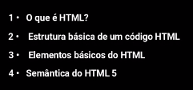

# Desenvolvimento FrontEnd

## Índice

- [Desenvolvimento FrontEnd](#desenvolvimento-frontend)
  - [Índice](#índice)
  - [Antes de começar](#antes-de-começar)
  - [Ambiente de programação](#ambiente-de-programação)
    - [O que são IDEs de desenvolvimento e como instalar a sua](#o-que-são-ides-de-desenvolvimento-e-como-instalar-a-sua)
    - [Explorando o VS Code e criando a primeira página HTML](#explorando-o-vs-code-e-criando-a-primeira-página-html)
    - [TEXTO: Preparando o ambiente de desenvolvimento](#texto-preparando-o-ambiente-de-desenvolvimento)
  - [Conceitos básicos do HTML](#conceitos-básicos-do-html)
    - [O que é HTML?](#o-que-é-html)
    - [Estrutura básica de um código HTML](#estrutura-básica-de-um-código-html)
    - [Elementos básicos do HTML](#elementos-básicos-do-html)
    - [Semântica do HTML 5](#semântica-do-html-5)
    - [TEXTO: Conceitos básicos do HTML](#texto-conceitos-básicos-do-html)
  - [Mídia com HTML](#mídia-com-html)
    - [Como inserir imagens na página HTML](#como-inserir-imagens-na-página-html)
    - [Como inserir vídeos na página HTML](#como-inserir-vídeos-na-página-html)
    - [Como apresentar conteúdo em listas](#como-apresentar-conteúdo-em-listas)
    - [TEXTO: Mídia com HTML](#texto-mídia-com-html)
  - [Montando tabelas com HTML](#montando-tabelas-com-html)
    - [O que são tabelas e qual é a estrutura básica de uma tabela](#o-que-são-tabelas-e-qual-é-a-estrutura-básica-de-uma-tabela)
    - [Estrutura semântica de uma tabela](#estrutura-semântica-de-uma-tabela)
    - [TEXTO: Montando tabelas com HTML](#texto-montando-tabelas-com-html)
  - [Criação de formulários com HTML](#criação-de-formulários-com-html)
    - [O que são formulários? Estrutura básica de um formulário](#o-que-são-formulários-estrutura-básica-de-um-formulário)
    - [Tipos de campos para envio de dados: Texto, e-mail, data, número e senha](#tipos-de-campos-para-envio-de-dados-texto-e-mail-data-número-e-senha)
    - [TEXTO: Criação de formulários com HTML](#texto-criação-de-formulários-com-html)
  - [Criação de formulários com HTML](#criação-de-formulários-com-html-1)
    - [Tipos de campos para envio de dados: Caixas de seleção](#tipos-de-campos-para-envio-de-dados-caixas-de-seleção)
    - [Tipos de campos para envio de dados: Botões de radio](#tipos-de-campos-para-envio-de-dados-botões-de-radio)
    - [Tipos de campos para envio de dados: Lista suspensa](#tipos-de-campos-para-envio-de-dados-lista-suspensa)
    - [TEXTO: Continuação: Formulários com HTML](#texto-continuação-formulários-com-html)
  - [CSS: Entendendo sobre estilos](#css-entendendo-sobre-estilos)
    - [O que é o CSS e como é sua Sintaxe](#o-que-é-o-css-e-como-é-sua-sintaxe)
    - [Formas de adicionar CSS ao documento](#formas-de-adicionar-css-ao-documento)
    - [TEXTO: CSS - Entendendo sobre estilos](#texto-css---entendendo-sobre-estilos)
  - [CSS: Criando estilos](#css-criando-estilos)
    - [Propriedades para texto](#propriedades-para-texto)
    - [Propriedades para elementos em geral](#propriedades-para-elementos-em-geral)
    - [Formatando listas para menu](#formatando-listas-para-menu)
    - [Estilizando tabelas com pseudo-classe](#estilizando-tabelas-com-pseudo-classe)
    - [Usando caixas e atribuindo classes e Ids](#usando-caixas-e-atribuindo-classes-e-ids)
    - [TEXTO: CSS: Criando estilos](#texto-css-criando-estilos)
  - [Introdução ao Bootstrap](#introdução-ao-bootstrap)
    - [O que é o Bootstrap?](#o-que-é-o-bootstrap)
    - [Sistema de GRID](#sistema-de-grid)
    - [Menus com Bootstrap](#menus-com-bootstrap)
    - [TEXTO: Introdução ao Bootstrap](#texto-introdução-ao-bootstrap)
  - [Containers com Bootstrap](#containers-com-bootstrap)
    - [Containers](#containers)
    - [Formulários e botões](#formulários-e-botões)
    - [Tabelas](#tabelas)
    - [TEXTO: Containers com Bootstrap](#texto-containers-com-bootstrap)
  - [Avançando com bootstrap](#avançando-com-bootstrap)
    - [Carousel](#carousel)
    - [Cards](#cards)
    - [Modal](#modal)
    - [Exemplos de base](#exemplos-de-base)
    - [TEXTO: Avançando com Bootstrap](#texto-avançando-com-bootstrap)
  - [Site com base em um modelo (template)](#site-com-base-em-um-modelo-template)
    - [Onde encontrar e baixar templates e sites em Bootstrap](#onde-encontrar-e-baixar-templates-e-sites-em-bootstrap)
    - [Criando um portfólio baseado em um template](#criando-um-portfólio-baseado-em-um-template)
    - [TEXTO: Site com base em um modelo (template)](#texto-site-com-base-em-um-modelo-template)
  - [Versionamento de código](#versionamento-de-código)
    - [Versionamento de código: Introdução](#versionamento-de-código-introdução)
    - [Instalando e configurando o Git em sua máquina](#instalando-e-configurando-o-git-em-sua-máquina)
    - [Iniciando o versionamento de código](#iniciando-o-versionamento-de-código)
    - [Avançando no versionamento de código](#avançando-no-versionamento-de-código)
    - [TEXTO: Versionamento de código](#texto-versionamento-de-código)
  - [Github Pages](#github-pages)
    - [Criando uma conta na plataforma GitHub](#criando-uma-conta-na-plataforma-github)
    - [Criando um repositório para o seu projeto no GitHub](#criando-um-repositório-para-o-seu-projeto-no-github)
    - [O que é o GitHub Pages?](#o-que-é-o-github-pages)
    - [Publicando seu projeto no GitHub Pages](#publicando-seu-projeto-no-github-pages)
    - [TEXTO: Github Pages](#texto-github-pages)
  - [O que é a Internet?](#o-que-é-a-internet)
    - [TEXTO: O que é a Internet?](#texto-o-que-é-a-internet)
  - [Entendimento do código-fonte](#entendimento-do-código-fonte)
    - [TEXTO: Entendimento do código-fonte](#texto-entendimento-do-código-fonte)
  - [Materiais de apoio e referências](#materiais-de-apoio-e-referências)

## Antes de começar

- [x]  Criar pasta referente ao curso
- [x]  Adicionar link da pasta nos atributos do curso
- [x]  Adicionar arquivos e links adicionais ao repositório (pdf, pptx, etc)

## Ambiente de programação

### O que são IDEs de desenvolvimento e como instalar a sua

O que são IDEs?

- IDE é um acrônimo para **Integrated Development Environment** que significa Ambiente de Desenvolvimento Integrado.
- Uma IDE possui funcionalidades de autocompletar valores úteis para a programação, colocar cores para palavras reservadas da linguagem, ajuda a depurar o código, ajuda a apontar erro durante a escrita do código, etc…

Exemplos de IDEs:

- NetBeans → muito utilizada para Java
- Eclipse → útil para diversas linguagens como Java e PHP
- VSCode → bastante usada para várias linguagens, é mais leve por não oferecer um ambiente pronto de cara

Para usar o VSCode vamos baixar a partir [deste link](https://code.visualstudio.com/download)

### Explorando o VS Code e criando a primeira página HTML

O VSCode possui diversas extensões.

Algumas das extensões muito úteis para trabalhar com o desenvolvimento HTML e CSS são:

- IntelliSense for CSS class names in HTML
- Path Intellisense
- CSS Peek

### TEXTO: Preparando o ambiente de desenvolvimento

- PDF

    [01_preparando_o_ambiente_de_desenvolvimento.pdf](./for_readme/01_preparando_o_ambiente_de_desenvolvimento.pdf)

## Conceitos básicos do HTML

### O que é HTML?

Nas próximas aulas vamos responder:



HTML é um acrônimo para **Hiper Text Markup Language** que significa Linguagem de Marcação de Hipertexto.

É a linguagem padrão criada para páginas web. Foi criada pelo britânico Tim Berners-Lee, em 1991. **O HTML é mantido pelo W3C (World Wide Web Consortium), um consórcio de pessoas que definem os padrões da linguagem.**

O HTML consiste em **elementos (tags)** que dizem ao navegador como apresentar a página, por exemplo, o **HTML diz “isto é um link” ou “isto é um título”.**

- A evolução do HTML se dá pela tabela abaixo

    

### Estrutura básica de um código HTML

O HTML possui alguns elementos indispensáveis em sua estrutura.

- A estrutura básica do HTML é a demonstrada abaixo

    

Sobre as tags:

- html → código do HTML fica dentro desta tag
- head → metadados do HTML, links de referência de estilo e etc
- title → titulo da página que aparecerá na aba do navegador
- body → corpo do HTML

- Abaixo o código inicialmente desenvolvido

    ```html
    <!DOCTYPE html>
    <html lang="pt-br">
    
    <head>
        <meta charset="UTF-8">
        <meta name="viewport" content="width=device-width, initial-scale=1.0">
        <title>Exemplo</title>
    </head>
    
    <body>
        Olá Mundo
    </body>
    
    </html>
    ```

### Elementos básicos do HTML

Alguns dos elementos básicos do HTML são as tags de titulo, parágrafo e link, onde:

- h1, h2, h3 (até 6) → títulos
- p → parágrafo
- a → link

- Abaixo um exemplo de código

    

- Meu código

    ```html
    <!DOCTYPE html>
    <html lang="pt-br">
    
    <head>
        <meta charset="UTF-8">
        <meta name="viewport" content="width=device-width, initial-scale=1.0">
        <title>Exemplo</title>
    </head>
    
    <body>
        <h1>Título</h1>
        <h2>Subtítulo</h2>
        <p>Lorem, ipsum dolor sit amet consectetur adipisicing elit. Natus non aut alias nesciunt quis? Unde quae nesciunt nobis, aspernatur odio ad consequatur numquam quas assumenda inventore? Aspernatur <a href="https://www.lipsum.com/">numquam hic quaerat.</a></p>
        
        <!-- Tag de quebra de linha -->
        <br><br>
    
        <!-- Tag de linhapara separar o texto -->
        <hr>
    </body>
    
    </html>
    ```

### Semântica do HTML 5

O HTML5 introduziu o conceito de **elementos semânticos em sua sintaxe.**

Elementos semânticos são elementos com significado.

- Abaixo um exemplo

    

> **As tags semânticas surgiram para facilitar a vida do desenvolvedor e ajudam a melhorar o ranqueamento do site nos sistemas de busca.**
>

- O código desenvolvido até então se encontra abaixo

    ```html
    <!DOCTYPE html>
    <html lang="pt-br">
    
    <head>
        <meta charset="UTF-8">
        <meta name="viewport" content="width=device-width, initial-scale=1.0">
        <title>Exemplo</title>
    </head>
    
    <body>
        <header>
            <h1>Venha descobrir sua série favorita!</h1>
        </header>
    
        <section>
            <h2>Subtítulo</h2>
            <p>Lorem, ipsum dolor sit amet consectetur adipisicing elit. Natus non aut alias nesciunt quis? Unde quae
                nesciunt nobis, aspernatur odio ad consequatur numquam quas assumenda inventore? Aspernatur <a
                    href="https://www.lipsum.com/">numquam hic quaerat.</a></p>
            <!-- Tag de quebra de linha -->
            <br><br>
    
            <!-- Tag de linhapara separar o texto -->
            <hr>
        </section>
    
        <footer>
            Desenvolvido por Marlon Prado
        </footer>
    
    </body>
    
    </html>
    ```

### TEXTO: Conceitos básicos do HTML

- PDF

    [02_conceitos_basicos_do_html.pdf](./for_readme/02_conceitos_basicos_do_html.pdf)

## Mídia com HTML

### Como inserir imagens na página HTML

A tag `` é usada para incorporar uma imagem no HTML. Ela não anexa a imagem, apenas incorpora ela, buscando ela de algum diretório existente.

Ela não possui uma tag de fechamento e possui as propriedades `src` e `alt` .

A propriedade alt é útil em diversos cenários, como:

- Leitores de tela para deficientes visuais
- No caso da imagem não ser carregada corretamente
- No caso do navegador não exibir a imagem
- O navegador pode realizar buscas a partir deste texto

Geralmente as imagens ficam dentro de um diretório chamado **img.**

- Abaixo um exemplo de uso

    

A tag img existe desde muito tempo no HTML, mas no HTML 5 surgiu a tag **figure** que diz aos navegadores que ali possui uma imagem e ****também surgiu a tag **figcaption** que é a legenda da imagem. Isso resolve a falta de relação que havia ao criar uma tag img e em seguida um parágrafo referenciando aquela imagem.

- Abaixo um exemplo de uso

    

### Como inserir vídeos na página HTML

A tag `video` permite incluir a tags `source` internamente, onde ela terá o atributo `src` e `type` que especificam o caminho o vídeo e o tipo de arquivo, respectivamente.

> Podemos usar várias tags `source` para referenciar a tipos de vídeo diferentes, pois pode ocorrer do navegador não reconhecer determinado tipo.
>

A tag `video` possui o atributo **controls** que serve para inserir os controles

- Exemplo

    

- Exemplo prático no código

    ```html
    <video width="500px" controls>
            <source src="./video/presentation-xbox-series-x.mp4" type="video/mp4">
            Seu navegador não suporta este formato de vídeo. <a href="./video/presentation-xbox-series-x.mp4">Clique aqui para baixar</a>
    </video>
    ```

### Como apresentar conteúdo em listas

No HTML podemos usar 3 tipos de listas, as **ordenadas**, as **não ordenadas** e as de **descrição.**

- Exemplo

    

Listas são comumente usadas para criação de menus. Podemos usar a tag `nav` para **criar um menu de navegação** e dentro dela utilizar uma tag de **lista não ordenada,**  a tag `ul`.

Vamos criar uma página única de navegação, onde cada link do menu será uma âncora para uma parte da página.

- Exemplo do código

    

### TEXTO: Mídia com HTML

- PDF

    [03_midia_com_html.pdf](./for_readme/03_midia_com_html.pdf)

## Montando tabelas com HTML

### O que são tabelas e qual é a estrutura básica de uma tabela

> **Tabelas são conjuntos de dados estruturados compostos de linhas e colunas**
>

A estrutura de uma tabela é composta de linhas e colunas, no HTML, as tags são:

- **table →** representa a tabela em si
- **th (table head) →** representa o cabeçalho / linha inicial da tabela
- **tr (table row) →** representa a linha da tabela
- **td (table data) →** representa uma célula dentro da linha da tabela

Uma tabela pode ter quantas linhas for necessário, mas **é importante garantir que o número de células (dados) seja o mesmo em todas as linhas**.

- Exemplo

    

No nosso código, vamos adicionar uma tabela ao fim do código, após o vídeo.

- Exemplo do código

    

### Estrutura semântica de uma tabela

O HTML 5 introduziu tags auxiliares semânticas para trabalhar com tabelas, sendo elas:

- **thead →** define onde está o cabeçalho
- **tbody →** define onde está o corpo da tabela
- **tfoot →** define onde está o rodapé
- **caption →** define o título da tabela

- Exemplo

    

No nosso código, podemos fazer os ajustes elencados abaixo.

- Código

    ```html
    <section>
            <!-- Tabalea -->
            <table border>
                <!-- Descrição da tabela -->
                <caption>Produtos e seus valores</caption>
                
                <!-- Cabeçalho da tabela -->
                <thead>
                    <tr>
                        <th>Produto</th>
                        <th>Valor</th>
                    </tr>
                </thead>
    
                <!-- Corpo da tabela -->
                <tbody>
                    <tr>
                        <td>Playstation 5</td>
                        <td>R$ 5000</td>
                    </tr>
                    <tr>
                        <td>Xbox Series X</td>
                        <td>R$ 4000</td>
                    </tr>
                    <tr>
                        <td>Nintendo Switch</td>
                        <td>R$ 3000</td>
                    </tr>
                </tbody>
                
                <!-- Rodapé da tabela -->
                <tfoot>
                    <tr>
                        <td>Produto</td>
                        <td>Valor</td>
                    </tr>
                </tfoot>
            </table>
        </section>
    ```

### TEXTO: Montando tabelas com HTML

- PDF

    [04_montando_tabelas_com_html.pdf](./for_readme/04_montando_tabelas_com_html.pdf)

## Criação de formulários com HTML

### O que são formulários? Estrutura básica de um formulário

> Formulário são estruturas utilizadas para **coletar a entrada de dados**
>

Formulários são compostos por elementos como `form`, `label`, `input`. Onde respectivamente representam o **formulário**, a **descrição do campo** e o **campo para entrada de dados**.

A tag form possui o atributo `action` e `method` que são o **direcionamento do envio** do formulário e o **método de envio**.

- Exemplo

    

- Em código

    

### Tipos de campos para envio de dados: Texto, e-mail, data, número e senha

Existem alguns outros tipos de input em formulários além do `text` , por exemplo:

- Email → verifica se texto é composto por algo + @ + domínio
- Date → permite inserção de datas formatadas
- Number → aceita somente números e adiciona seletor
- Password → oculta texto digitado

Há também o atributo `required` que torna um input obrigatório, impedindo o envio do formulário se ele não estiver preenchido.

- Exemplo

    

### TEXTO: Criação de formulários com HTML

- PDF

    [05_criacao_de_formularios_com_html.pdf](./for_readme/05_criacao_de_formularios_com_html.pdf)

## Criação de formulários com HTML

### Tipos de campos para envio de dados: Caixas de seleção

Caixas de seleção (`checkbox` ) são tipos de input que permitem a entrada de usuário a partir e uma seleção de elementos.

Inputs do tipo `checkbox` trazem consigo tags `value` que são as opções.

- Exemplo

    

- No código

    ```html
    <section>
            <h2>Orçamento</h2>
            <form method="GET" action="">
    
                <fieldset>
                    <legend>Dados do usuário</legend>
                    <label for="nome">Nome</label>
                    <br>
                    <input type="text" name="name" id="name">
                    <br><br>
    
                    <label for="email">Email</label>
                    <br>
                    <input type="email" name="email" id="email">
                    <br><br>
                </fieldset>
    
                <fieldset>
                    <legend>Dados do orçamento</legend>
                    <label for="date-of-pay">Data do pagamento</label>
                    <br>
                    <input type="date" name="date-of-pay" id="date">
                    <br><br>
    
                    <label for="date-of-withdrawal">Data de retirada</label>
                    <br>
                    <input type="date" name="date-of-withdrawal" id="date">
                    <br><br>
    
                    <label for="quantity">Quantidade</label>
                    <br>
                    <input type="number" name="quantity" id="quantity">
                    <br><br>
                </fieldset>
    
                <fieldset>
                    <legend for="day-of-week">Qual melhor dia para contato?</legend>
    
                    <input type="checkbox" name="sunday" id="sunday" value="sunday"> Domingo
                    <br><input type="checkbox" name="monday" id="monday" value="monday"> Segunda-feira
                    <br><input type="checkbox" name="tuesday" id="tuesday" value="tuesday"> Terça-feira
                    <br><input type="checkbox" name="wednesday" id="wednesday" value="wednesday"> Quarta-feira
                    <br><input type="checkbox" name="thursday" id="thursday" value="thursday"> Quinta-feira
                    <br><input type="checkbox" name="friday" id="friday" value="friday"> Sexta-feira
                    <br><input type="checkbox" name="saturday" id="saturday" value="saturday"> Sábado
                </fieldset>
    
                <br>
                    <label for="comment">Comentário</label>
                    <br>
                    <textarea name="comment" id="comment" cols="50" rows="5"></textarea>
                    <br>
                <button>Salvar</button>
            </form>
        </section>
    ```

- Resultado em tela

    

### Tipos de campos para envio de dados: Botões de radio

Os inputs do tipo `radio` são parecidos com `checkbox` , mas **permitem o** **usuário selecionar somente um item**

- Exemplo

    

- Código

    

- Em tela

    

### Tipos de campos para envio de dados: Lista suspensa

O elemento `select`  permite criar listas suspensas em HTML.

- Exemplo

    

- Código

    

- Resultado em tela

    

### TEXTO: Continuação: Formulários com HTML

- PDF

    [06_continuacao_formularios_com_html.pdf](./for_readme/06_continuacao_formularios_com_html.pdf)

## CSS: Entendendo sobre estilos

### O que é o CSS e como é sua Sintaxe

CSS significa **Cascading Style Sheets**, ou seja, **folhas de estilo em cascata.**

Os padrões dessa linguagem é definida pelo W3C e ela **serve para dar estilo às páginas.**

- Exemplo

    

> A palavra cascata significa que um estilo aplicado ao elemento pai será aplicado aos filhos dentro do pai
>

- Datas das versões do CSS

    

O CSS é composto por:

- seletor → elemento a ser modificado
- propriedade → propriedade a ser modificada
- valor → valor novo para a propriedade

- Exemplo

    

### Formas de adicionar CSS ao documento

Existem 3 formas de adicionar CSS ao documento HTML, sendo elas:

- Em linha (inline) → dentro da própria tag HTML a ser modificada (adicionada individualmente)
- Eterna (extenal) → link para um arquivo com a extensão `.css` dentro da tag `head`
- Interna (internal) → dentro de uma tag `style` na tag `head`

- Abaixo seus respectivos exemplos

    

- Código de exemplo

    

Ao reparar no resultado da página, podemos ver que o HTML prioriza o CSS na ordem abaixo:

1. Externo
2. Inline
3. Interno

Ou seja, se tivermos um mesmo elemento sendo modificado nas 3 formas de editar o CSS, a ordem de modificação respeitada será essa.

### TEXTO: CSS - Entendendo sobre estilos

- PDF

    [07_css_entendendo_sobre_estilos.pdf](./for_readme/07_css_entendendo_sobre_estilos.pdf)

## CSS: Criando estilos

### Propriedades para texto

Nas próximas aulas serão vistos os assuntos abaixo:


O texto pode ter diversas propriedades modificadas como a fonte, família, cores, tamanhos, etc

Importante sempre **sugerir 2 famílias de fonte** e uma terceira genérica para o caso do navegador não ter aquela.


Exemplo de código CSS:

```css
p {
    color: black;
}

body{
    font-weight: 400; 
    font-family: Lato, Helvetica, sans-serif;
    font-size: 15px;
    line-height: 2.2em;
    color: #818181;
}

h1{
    font-size: 40px;
    color: #303030;
}

h2{
    font-size: 24px;
    text-transform: uppercase;
    color: #303030;
    font-weight: 600;
}
```

### Propriedades para elementos em geral

**Background** define o fundo do elemento.

**Margin** define a área de margem dos quatro lados do elemento.


Código desenvolvido:

```css
p {
    color: black;
}

body{
    font-weight: 400; 
    font-family: Lato, Helvetica, sans-serif;
    font-size: 15px;
    line-height: 2.2em;
    color: #818181;
}

h1{
    font-size: 40px;
    color: #303030;
}

h2{
    font-size: 24px;
    text-transform: uppercase;
    color: #303030;
    font-weight: 600;
}

header{
    background-color: #ee6f49;
    text-align: center;
    margin: 10px;
}
```

### Formatando listas para menu


Código desenvolvido:

```css
nav li a{
    padding: 10;
    color: white;
    text-decoration: none;
}

nav li {
    float: left;
}

nav ul{ 
    float: right;
    list-style: none;
}

```

### Estilizando tabelas com pseudo-classe


Código HTML desenvolvido:

```html
    <section>
        <!-- Tabela -->
        <table>
            <!-- Descrição da tabela -->
            <caption>Produtos e seus valores</caption>

            <!-- Cabeçalho da tabela -->
            <thead>
                <tr>
                    <th>Produto</th>
                    <th>Valor</th>
                </tr>
            </thead>

            <!-- Corpo da tabela -->
            <tbody>
                <tr>
                    <td>Playstation 5</td>
                    <td>R$ 5000</td>
                </tr>
                <tr>
                    <td>Xbox Series X</td>
                    <td>R$ 4000</td>
                </tr>
                <tr>
                    <td>Nintendo Switch</td>
                    <td>R$ 3000</td>
                </tr>
            </tbody>

            <!-- Rodapé da tabela -->
            <tfoot>
                <tr>
                    <td>Produto</td>
                    <td>Valor</td>
                </tr>
            </tfoot>
        </table>
    </section>

```

Código CSS:

```css

table{
    width: 100%;
}

table td{
    color: #303030;
    padding: 5px;
}

table tr:nth-child(even){
    background-color: #e9e9e9;
}

table tr:nth-child(odd){
    background-color: #bdbdbd;
}

table thead th{
    background-color: #ee6f49;
    color: white;
}
```

Resultado:


### Usando caixas e atribuindo classes e Ids


Considerando este HTML:

```html
    <section>
        <h2>PS5</h2>

        <p style="color:red">O PS5 é um console de última geração com recursos avançados úteis para jogar qualquer jogo
            da atualidade,
            você pode conferir as especificações <a href="https://www.playstation.com/pt-br/ps5/">no site da Sony</a>
        </p>
        <p>O PS5 é um console de última geração com recursos avançados úteis para jogar qualquer jogo da atualidade,
            você pode conferir as especificações <a href="https://www.playstation.com/pt-br/ps5/">no site da Sony</a>
        </p>

        <p>O PS5 é um console de última geração com recursos avançados úteis para jogar qualquer jogo da atualidade,
            você pode conferir as especificações <a href="https://www.playstation.com/pt-br/ps5/">no site da Sony</a>
        </p>

        <section id="consoles">
            <div class="figuras">
                <figure>
                    <!-- Tag de imagem -->
                    
                    <!-- Tag de legenda para a imagem -->
                    <figcaption>Playstation 5</figcaption>
                </figure>

                <figure>
                    <!-- Tag de imagem -->
                    
                    <!-- Tag de legenda para a imagem -->
                    <figcaption>Nintendo Switch</figcaption>
                </figure>

                <figure>
                    <!-- Tag de imagem -->
                    
                    <!-- Tag de legenda para a imagem -->
                    <figcaption>Xbox Series X</figcaption>
                </figure>

            </div>

            <div class="videos">
                <video width="500px" controls>
                    <source src="./video/presentation-xbox-series-x.mp4" type="video/mp4">
                    Seu navegador não suporta este formato de vídeo. <a
                        href="./video/presentation-xbox-series-x.mp4">Clique
                        aqui para baixar</a>
                </video>
            </div>
```

Código CSS:

```css
#consoles .figuras figure{
    display: inline-block;
}

#consoles .figuras, #consoles .videos{
    text-align: center;
}

```

Resultado:


### TEXTO: CSS: Criando estilos

- PDF

    [08_css_criando_estilos.pdf](./for_readme/08_css_criando_estilos.pdf)

## Introdução ao Bootstrap

### O que é o Bootstrap?

O que será visto nesta parte do curso:


### Sistema de GRID

Para usar o Bootstrap devemos considerar a disposição de elementos em 12 linhas por 12 colunas, ou seja, o sistema de GRID.


Na prática, basta mudar a tag para incluir a tag do bootstrap:

```html
        <section id="consoles">
            <div class="row">
                <figure class="col text-center">
                    <!-- Tag de imagem -->
                    
                    <!-- Tag de legenda para a imagem -->
                    <figcaption>Playstation 5</figcaption>
                </figure>

                <figure class="col text-center">
                    <!-- Tag de imagem -->
                    
                    <!-- Tag de legenda para a imagem -->
                    <figcaption>Nintendo Switch</figcaption>
                </figure>

                <figure class="col text-center">
                    <!-- Tag de imagem -->
                    
                    <!-- Tag de legenda para a imagem -->
                    <figcaption>Xbox Series X</figcaption>
                </figure>

            </div>
```

### Menus com Bootstrap

O bootstrap possui classes específicas que podem expandir ou recolher os menus de acordo com o tamanho de tela;


Na prática:

```html
<header>
        <<nav class="navbar navbar-expand-lg navbar-light bg-light">
            <a class="navbar-brand" href="#">Navbar</a>
            <button class="navbar-toggler" type="button" data-toggle="collapse" data-target="#navbarSupportedContent"
                aria-controls="navbarSupportedContent" aria-expanded="false" aria-label="Toggle navigation">
                <span class="navbar-toggler-icon"></span>
            </button>

            <div class="collapse navbar-collapse" id="navbarSupportedContent">
                <ul class="navbar-nav mr-auto">
                    <li class="nav-item active">
                        <a class="nav-link" href="#">Home <span class="sr-only">(current)</span></a>
                    </li>
                    <li class="nav-item">
                        <a class="nav-link" href="#">Link</a>
                    </li>
                    <li class="nav-item dropdown">
                        <a class="nav-link dropdown-toggle" href="#" id="navbarDropdown" role="button"
                            data-toggle="dropdown" aria-haspopup="true" aria-expanded="false">
                            Dropdown
                        </a>
                        <div class="dropdown-menu" aria-labelledby="navbarDropdown">
                            <a class="dropdown-item" href="#">Action</a>
                            <a class="dropdown-item" href="#">Another action</a>
                            <div class="dropdown-divider"></div>
                            <a class="dropdown-item" href="#">Something else here</a>
                        </div>
                    </li>
                    <li class="nav-item">
                        <a class="nav-link disabled" href="#">Disabled</a>
                    </li>
                </ul>
                <form class="form-inline my-2 my-lg-0">
                    <input class="form-control mr-sm-2" type="search" placeholder="Search" aria-label="Search">
                    <button class="btn btn-outline-success my-2 my-sm-0" type="submit">Search</button>
                </form>
            </div>
            </nav>

            <!-- Exemplo de código CSS inline -->
            <h1 style="color:red">Encontre os melhores eletrônicos com os melhores preços e maior qualidade!</h1>
    </header>

```

### TEXTO: Introdução ao Bootstrap

- PDF

    [09_introducao_ao_bootstrap.pdf](./for_readme/09_introducao_ao_bootstrap.pdf)

## Containers com Bootstrap

### Containers

**Containers são caixas** utilizadas para organizar os conteúdos dentro da página.


### Formulários e botões


### Tabelas


### TEXTO: Containers com Bootstrap

- PDF

    [10_containers_com_bootstrap.pdf](./for_readme/10_containers_com_bootstrap.pdf)

## Avançando com bootstrap

### Carousel

Com carousel podemos incluir imagens que rodam na página com um clique

[https://getbootstrap.com/docs/4.0/components/carousel/](https://getbootstrap.com/docs/4.0/components/carousel/)’

### Cards

Cards são componentes de cartões.


[https://getbootstrap.com/docs/5.0/components/card/](https://getbootstrap.com/docs/5.0/components/card/)

### Modal

Modal é uma caixa de diálogo flutuante para interação com o usuário


[https://getbootstrap.com/docs/5.0/components/modal/](https://getbootstrap.com/docs/5.0/components/modal/)

### Exemplos de base

Existem páginas de exemplo que podemos aproveitar no uso do bootstrap


[https://getbootstrap.com/docs/4.0/examples/checkout/](https://getbootstrap.com/docs/4.0/examples/checkout/)

### TEXTO: Avançando com Bootstrap

- PDF

    [11_avancando_com_bootstrap.pdf](./for_readme/11_avancando_com_bootstrap.pdf)

## Site com base em um modelo (template)

### Onde encontrar e baixar templates e sites em Bootstrap

Para encontrar templates basta pesquisar Bootstrap Templates no navegador e localizar alguns templates que podem ser utilizado para poupar tempo de código.

### Criando um portfólio baseado em um template

Baixando o template podemos trocar as imagens e textos que vem por padrão para alguma que referencie a nós

### TEXTO: Site com base em um modelo (template)

- PDF

    [12_site_com_base_em_um_modelo.pdf](./for_readme/12_site_com_base_em_um_modelo.pdf)

## Versionamento de código

### Versionamento de código: Introdução

Versionamento de código permite recuperar códigos

### Instalando e configurando o Git em sua máquina

Necessário instalar o Git por [este link](https://git-scm.com/downloads)

### Iniciando o versionamento de código

Agora é só abrir um projeto no VSCode e dar o comando `git init` no terminal da raiz do projeto

Depois dar `git add .` para adicionar tudo

Depois dar `git commit -m` e digitar a mensagem de commit ao lado

### Avançando no versionamento de código

Branchs são ramos que podem ser criados para desenvolver novas funcionalidades

Podemos dar o comando `git branch <nome-da-branch>` para criar uma nova

E depois `git checkout <nome-da-branch>` para mudar para o ramo criado

Ou `git branch checkout -b <nome-da-branch>` para fazer ambas as coisas

Após, podemos codar alterações nessa branch criada e aberta e depois de realizar as alterações acessamos a principal com `git checkout main` e utilizamos o `git merge <nome-da-brancg>` para unificar as alterações

### TEXTO: Versionamento de código

- PDF

    [13_versionamento_de_codigo.pdf](./for_readme/13_versionamento_de_codigo.pdf)

## Github Pages

### Criando uma conta na plataforma GitHub

Precisamos criar conta no Github [neste link](https://github.com/)

### Criando um repositório para o seu projeto no GitHub

Após, podemos criar um repositório no Github na aba de repositórios

Após, pegamos a URL do repositório em .git e no projeto local usamos o comando `git remote add <url-do-repositorio>`

Isso adiciona o repositório remoto do GitHub

Depois `git push origin main` para empurrar as modificações da branch main para a branch remota

### O que é o GitHub Pages?

Github pages é um recurso de hospedagem de sites fornecido pelo Github que permite hospedar sites HTML, CSS e Javascript

### Publicando seu projeto no GitHub Pages

Para publicar no Github pages vamos até o repositório e suas configurações

Lá tem a opção de `Pages` onde escolhemos qual ramo vamos publicar

Após, ele fornece o site que ficará hospedado, podendo ou não adicionar um domínio específico

### TEXTO: Github Pages

- PDF

    [14_github_pages.pdf](./for_readme/14_github_pages.pdf)

## O que é a Internet?

### TEXTO: O que é a Internet?

- PDF

    [15_o_que_e_a_internet.pdf](./for_readme/15_o_que_e_a_internet.pdf)

## Entendimento do código-fonte

### TEXTO: Entendimento do código-fonte

- PDF

    [16_entendimento_do_codigo_fonte.pdf](./for_readme/16_entendimento_do_codigo_fonte.pdf)

## Materiais de apoio e referências

- Ementa do curso

    [Ementa - Desenvolvimento FrontEnd.pdf](./for_readme/Ementa_-_Desenvolvimento_FrontEnd.pdf)
